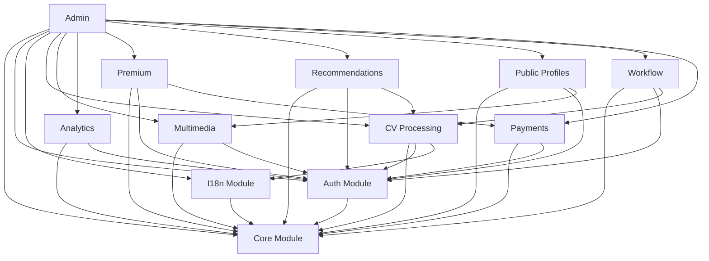
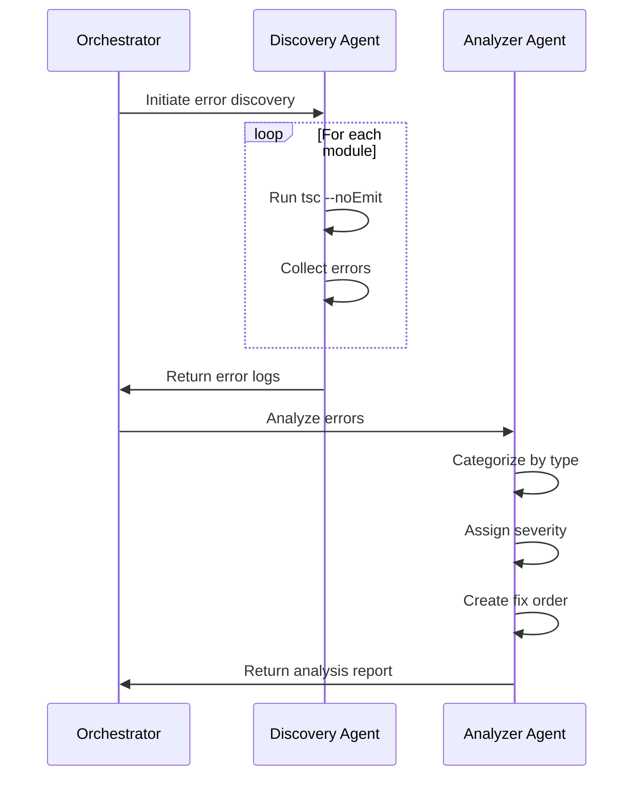
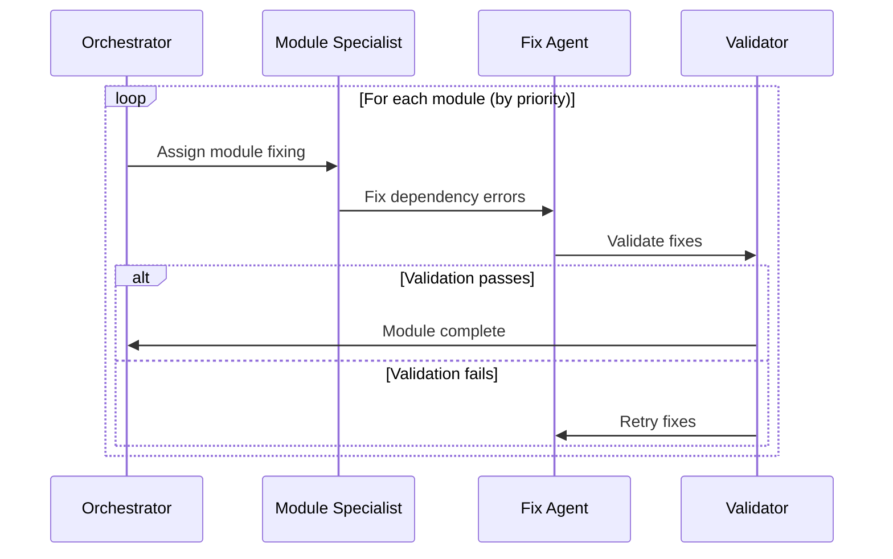
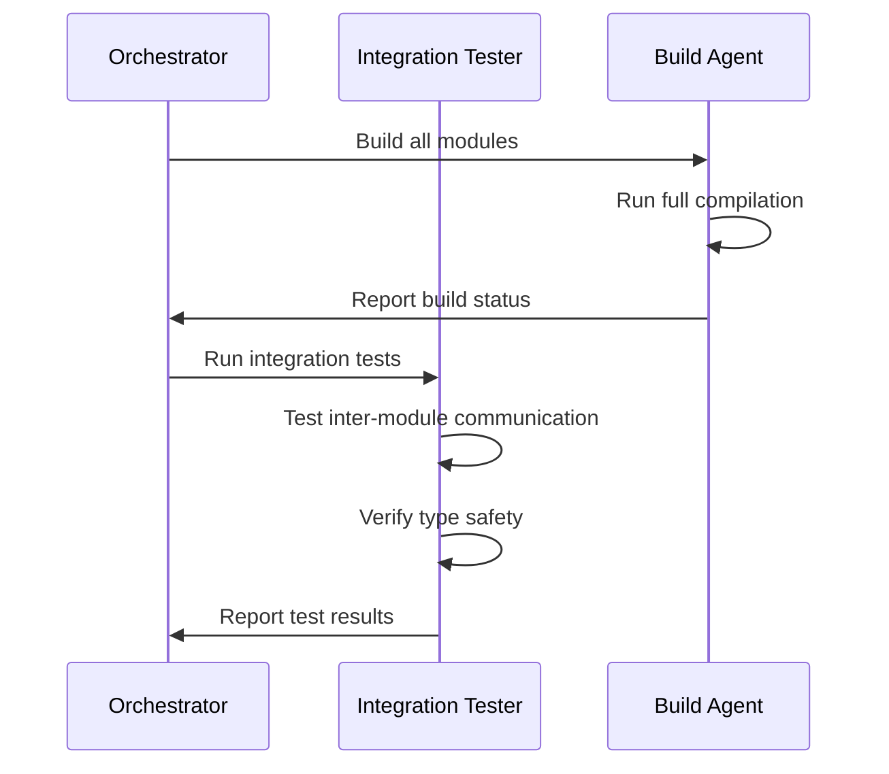

# CVPlus Comprehensive TypeScript Error Resolution Plan

**Author:** Gil Klainert  
**Date:** 2025-08-30  
**Status:** Planning  
**Priority:** Critical  
**Architecture Type:** Multi-Agent Orchestrated System Resolution  

## Executive Summary

This plan provides a comprehensive, systematic approach to discovering, categorizing, and resolving TypeScript compilation errors across all 12 CVPlus submodules. The strategy employs a multi-agent orchestration pattern with specialized subagents for discovery, analysis, fixing, and validation.

## Current State Analysis

### Submodule Architecture
- **Total Submodules:** 12 independent git repositories
- **Core Dependencies:** Complex inter-module dependency graph
- **Build System:** Individual TypeScript configurations per module
- **Current Issues:** Unknown number of compilation errors spread across modules

### Module Inventory
```
packages/
├── core/           - Foundation types and utilities
├── auth/           - Authentication services  
├── i18n/           - Internationalization
├── cv-processing/  - CV document processing
├── multimedia/     - Media handling
├── analytics/      - Analytics tracking
├── premium/        - Premium features
├── recommendations/- AI recommendations
├── public-profiles/- Public profile system
├── admin/          - Admin dashboard
├── workflow/       - Workflow management
└── payments/       - Payment processing
```

## Systematic Error Discovery Approach

### Phase 1: Baseline Assessment

#### 1.1 Module Dependency Mapping
```typescript
interface ModuleDependencyMap {
  module: string;
  directDependencies: string[];
  transitiveDependencies: string[];
  externalDependencies: string[];
  buildOrder: number;
}
```

#### 1.2 Discovery Script Creation
```bash
#!/bin/bash
# discover-ts-errors.sh

MODULES=(
  "core" "auth" "i18n" "cv-processing" 
  "multimedia" "analytics" "premium" 
  "recommendations" "public-profiles" 
  "admin" "workflow" "payments"
)

for MODULE in "${MODULES[@]}"; do
  echo "Analyzing $MODULE..."
  cd packages/$MODULE
  npx tsc --noEmit --pretty false 2>&1 | tee ../../logs/$MODULE-errors.log
  cd ../..
done
```

### Phase 2: Error Categorization

#### 2.1 Error Taxonomy
```yaml
ErrorCategories:
  DependencyErrors:
    - ModuleNotFound
    - CircularDependency
    - VersionMismatch
    
  TypeErrors:
    - TypeMismatch
    - MissingTypeDefinition
    - GenericConstraintViolation
    
  ImportErrors:
    - UnresolvedImport
    - WrongImportPath
    - MissingExport
    
  ConfigurationErrors:
    - TSConfigIssue
    - PathMappingError
    - CompilerOptionConflict
    
  InterfaceErrors:
    - PropertyMissing
    - InterfaceIncompatibility
    - OptionalityMismatch
```

#### 2.2 Severity Classification
```typescript
enum ErrorSeverity {
  CRITICAL = "Blocks compilation completely",
  HIGH = "Breaks module functionality",
  MEDIUM = "Affects type safety",
  LOW = "Minor type inconsistency"
}
```

## Priority-Based Fixing Order

### Dependency Resolution Order
```
1. Core Module (Foundation - No dependencies)
2. Auth Module (Depends on Core)
3. I18n Module (Depends on Core)
4. Analytics Module (Depends on Core, Auth)
5. CV-Processing Module (Depends on Core, Auth, I18n)
6. Multimedia Module (Depends on Core, Auth)
7. Workflow Module (Depends on Core, Auth, CV-Processing)
8. Payments Module (Depends on Core, Auth)
9. Premium Module (Depends on Core, Auth, Payments)
10. Recommendations Module (Depends on Core, Auth, CV-Processing)
11. Public-Profiles Module (Depends on Core, Auth, Multimedia)
12. Admin Module (Depends on all modules)
```

### Fix Priority Matrix
| Priority | Module | Reason | Dependencies |
|----------|--------|--------|--------------|
| P0 | core | Foundation for all | None |
| P1 | auth | Security critical | core |
| P1 | i18n | User-facing critical | core |
| P2 | cv-processing | Core business logic | core, auth, i18n |
| P2 | analytics | Data critical | core, auth |
| P3 | multimedia | Feature module | core, auth |
| P3 | workflow | Process management | core, auth, cv-processing |
| P3 | payments | Transaction critical | core, auth |
| P4 | premium | Feature enhancement | core, auth, payments |
| P4 | recommendations | AI features | core, auth, cv-processing |
| P5 | public-profiles | Public features | core, auth, multimedia |
| P6 | admin | Management interface | all modules |

## Module Dependency Analysis

### Dependency Graph Structure


### Circular Dependency Detection
```typescript
interface CircularDependencyCheck {
  detectCircular(): DependencyLoop[];
  breakCircular(loop: DependencyLoop): RefactoringPlan;
  validateAcyclic(): boolean;
}
```

## Orchestrator-Based Execution Strategy

### Multi-Agent Architecture

#### Master Orchestrator Configuration
```yaml
Orchestrator:
  name: typescript-error-orchestrator
  role: Master Coordinator
  responsibilities:
    - Task delegation
    - Progress monitoring
    - Quality gates enforcement
    - Inter-agent communication
    - Final validation
```

#### Specialist Subagent Team
```yaml
SubagentTeam:
  discovery-agent:
    role: Error Discovery Specialist
    tasks:
      - Run TypeScript compiler checks
      - Collect error logs
      - Generate error reports
      
  analyzer-agent:
    role: Error Analysis Specialist
    tasks:
      - Categorize errors
      - Determine severity
      - Identify root causes
      
  dependency-resolver:
    role: Dependency Resolution Specialist
    tasks:
      - Map module dependencies
      - Detect circular references
      - Propose dependency fixes
      
  type-fixer:
    role: TypeScript Type Specialist
    tasks:
      - Fix type mismatches
      - Add missing type definitions
      - Resolve generic constraints
      
  import-fixer:
    role: Import Resolution Specialist
    tasks:
      - Fix import paths
      - Resolve missing exports
      - Update module references
      
  config-specialist:
    role: Configuration Specialist
    tasks:
      - Fix tsconfig issues
      - Update path mappings
      - Resolve compiler options
      
  validator-agent:
    role: Validation Specialist
    tasks:
      - Run compilation checks
      - Execute test suites
      - Verify fixes
```

### Execution Workflow

#### Stage 1: Discovery & Analysis


#### Stage 2: Iterative Fixing


#### Stage 3: Integration Testing


## Validation and Testing Approach

### Module-Level Validation
```typescript
interface ModuleValidation {
  compileCheck(): CompilationResult;
  typeCheck(): TypeCheckResult;
  lintCheck(): LintResult;
  testSuite(): TestResult;
  integrationTest(): IntegrationResult;
}
```

### Cross-Module Validation
```typescript
interface CrossModuleValidation {
  dependencyCheck(): DependencyValidation;
  interfaceCompatibility(): InterfaceValidation;
  circularDependencyCheck(): CircularValidation;
  buildOrderValidation(): BuildOrderResult;
}
```

### Quality Gates
```yaml
QualityGates:
  Module:
    - No TypeScript errors
    - All tests passing
    - No lint violations
    - 100% type coverage
    
  Integration:
    - All modules compile
    - No circular dependencies
    - Interface compatibility
    - Build succeeds
    
  System:
    - Full deployment build
    - E2E tests passing
    - Performance benchmarks met
    - Security scan passing
```

## Implementation Timeline

### Week 1: Discovery & Analysis
- Day 1-2: Set up discovery infrastructure
- Day 3-4: Run comprehensive error discovery
- Day 5: Analyze and categorize errors

### Week 2: Core Module Fixes
- Day 1-3: Fix core module errors
- Day 4: Fix auth and i18n modules
- Day 5: Integration testing

### Week 3: Business Logic Modules
- Day 1-2: Fix cv-processing module
- Day 3: Fix analytics module
- Day 4: Fix multimedia module
- Day 5: Fix workflow module

### Week 4: Feature Modules
- Day 1: Fix payments module
- Day 2: Fix premium module
- Day 3: Fix recommendations module
- Day 4: Fix public-profiles module
- Day 5: Fix admin module

### Week 5: Integration & Validation
- Day 1-2: Full system build
- Day 3: Integration testing
- Day 4: Performance validation
- Day 5: Deployment preparation

## Risk Mitigation

### Identified Risks
1. **Breaking Changes:** Module interface changes affecting consumers
2. **Regression:** Fixes introducing new errors
3. **Dependency Hell:** Complex dependency resolution
4. **Time Overrun:** Underestimated complexity

### Mitigation Strategies
```yaml
Strategies:
  BreakingChanges:
    - Maintain backward compatibility
    - Use deprecation warnings
    - Version interfaces properly
    
  Regression:
    - Comprehensive test coverage
    - Incremental fixing approach
    - Continuous validation
    
  DependencyHell:
    - Clear dependency mapping
    - Modular fixing approach
    - Dependency injection patterns
    
  TimeOverrun:
    - Buffer time allocation
    - Parallel processing where possible
    - Clear escalation paths
```

## Success Criteria

### Module-Level Success
- ✅ Zero TypeScript compilation errors
- ✅ All unit tests passing
- ✅ Type coverage > 95%
- ✅ No circular dependencies

### System-Level Success
- ✅ Full system builds successfully
- ✅ All integration tests passing
- ✅ Deployment pipeline succeeds
- ✅ Production deployment ready

## Monitoring & Reporting

### Progress Dashboard
```typescript
interface ProgressDashboard {
  totalErrors: number;
  fixedErrors: number;
  remainingErrors: number;
  moduleStatus: Map<string, ModuleStatus>;
  estimatedCompletion: Date;
}
```

### Daily Reports
- Error count by module
- Fixes completed
- Blockers identified
- Next day priorities

## Rollback Strategy

### Checkpoint System
```bash
# Create restoration points
git tag pre-fix-baseline
git branch fix-backup-$(date +%Y%m%d)
```

### Emergency Rollback
```bash
#!/bin/bash
# emergency-rollback.sh

echo "Rolling back TypeScript fixes..."
git checkout pre-fix-baseline
npm run build:all
npm run test:all
```

## Post-Fix Maintenance

### Continuous Monitoring
- Pre-commit hooks for TypeScript checks
- CI/CD pipeline validation
- Weekly TypeScript audit
- Dependency update strategy

### Documentation Updates
- Update module interfaces documentation
- Create TypeScript best practices guide
- Document common error patterns
- Maintain fix decision log

## Appendix: Related Documentation

- [Mermaid Workflow Diagram](/docs/diagrams/typescript-error-resolution-workflow.mmd)
- [Module Dependency Graph](/docs/diagrams/module-dependency-graph.mmd)
- [Previous Fix Attempts](/docs/plans/2025-08-30-typescript-compilation-errors-systematic-resolution-plan.md)
- [Submodule Architecture](/docs/architecture/modular-architecture/)