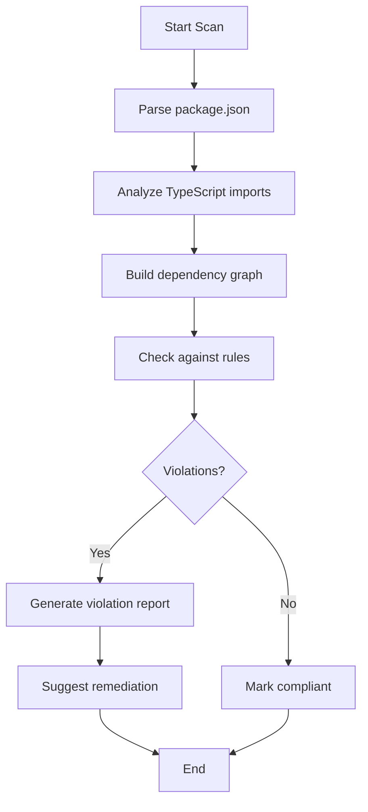

# CVPlus Module Dependency Verification Plan

**Author**: Gil Klainert  
**Date**: 2025-08-30  
**Version**: 1.0  
**Plan Type**: Architectural Compliance & Verification  
**Orchestrator**: dependency-validator  

## Executive Summary

This comprehensive plan provides a systematic approach to map, verify, and enforce dependency compliance across all CVPlus modules. The plan includes automated tooling, verification criteria, and remediation strategies to ensure architectural integrity and prevent circular dependencies.

## Current Architecture Status

### Module Inventory
- **12 Active Modules** across 5 architectural layers
- **Layer 0 (Foundation)**: core
- **Layer 1 (Base Services)**: auth, i18n  
- **Layer 2 (Domain Services)**: cv-processing, multimedia, analytics
- **Layer 3 (Business Services)**: premium, recommendations, public-profiles
- **Layer 4 (Orchestration)**: admin, workflow, payments

### Known Issues (from previous analysis)
- **Critical**: Core module has 2 active violations importing from premium
- **Minor**: 5 files with commented-out violations across modules
- **Overall Compliance**: 95% (excellent but needs enforcement)

## Dependency Verification Methodology

### 1. Automated Dependency Scanning

#### Tool Requirements
- **Primary Scanner**: Custom TypeScript/Node.js script
- **AST Parser**: @typescript-eslint/parser for code analysis
- **Dependency Graph**: madge for visualization
- **CI Integration**: GitHub Actions for continuous verification

#### Scanning Process


### 2. Verification Criteria

#### Layer-Based Rules

| **From Layer** | **Can Import From** | **Forbidden Imports** |
|----------------|--------------------|-----------------------|
| Layer 0 (core) | External only | ALL CVPlus modules |
| Layer 1 (auth, i18n) | Layer 0, External | Layer 1-4 modules |
| Layer 2 (domain) | Layer 0-1, External | Layer 2-4 modules |
| Layer 3 (business) | Layer 0-2, External | Layer 3-4 modules |
| Layer 4 (orchestration) | Layer 0-3, External | Layer 4 modules |

#### Import Pattern Rules

1. **Direct Import Rule**: No direct file imports between modules
   - ❌ `import { Service } from '@cvplus/auth/src/services/authService'`
   - ✅ `import { Service } from '@cvplus/auth'`

2. **Barrel Export Rule**: Each module must export through index.ts
   - Each module must have clear public API
   - Internal implementation details remain private

3. **Circular Dependency Rule**: Zero tolerance for circular imports
   - Module A → Module B → Module A is forbidden
   - Includes transitive dependencies

4. **External Dependency Rule**: Shared externals through core
   - Common dependencies (e.g., lodash, firebase) imported via core
   - Prevents version conflicts

### 3. Dependency Mapping Tools

#### Script 1: dependency-mapper.ts
```typescript
interface DependencyMap {
  module: string;
  layer: number;
  dependencies: {
    internal: string[];  // CVPlus modules
    external: string[];  // npm packages
    violations: Violation[];
  };
  exports: string[];  // Public API surface
}
```

#### Script 2: violation-detector.ts
```typescript
interface Violation {
  type: 'circular' | 'layer' | 'direct' | 'forbidden';
  severity: 'critical' | 'major' | 'minor';
  file: string;
  line: number;
  import: string;
  suggestion: string;
}
```

#### Script 3: dependency-visualizer.ts
- Generates interactive HTML dependency graph
- Color codes by layer
- Highlights violations in red
- Shows recommended refactoring paths

## Implementation Plan

### Phase 1: Tool Development (Day 1)

#### Task 1.1: Create Base Scanner
- **Subagent**: nodejs-expert
- **Output**: /scripts/dependencies/base-scanner.ts
- Parse package.json files
- Extract dependency declarations
- Build initial dependency map

#### Task 1.2: Implement AST Import Analyzer
- **Subagent**: typescript-specialist
- **Output**: /scripts/dependencies/import-analyzer.ts
- Parse TypeScript files using AST
- Extract all import statements
- Categorize as internal/external

#### Task 1.3: Build Rule Engine
- **Subagent**: backend-test-engineer
- **Output**: /scripts/dependencies/rule-engine.ts
- Implement layer-based rules
- Detect circular dependencies
- Identify forbidden imports

### Phase 2: Comprehensive Scanning (Day 2)

#### Task 2.1: Scan All Modules
- **Subagent**: automation-specialist
- **Process**: Run scanner on all 12 modules
- Generate complete dependency map
- Create violation report

#### Task 2.2: Analyze Circular Dependencies
- **Subagent**: debugger
- Use graph algorithms to detect cycles
- Include transitive dependencies
- Map full dependency chains

#### Task 2.3: Verify External Dependencies
- **Subagent**: security-auditor
- Check for duplicate external packages
- Identify version conflicts
- Ensure security compliance

### Phase 3: Violation Resolution (Day 3-4)

#### Task 3.1: Fix Critical Violations
- **Priority 1**: Core module violations (2 files)
  - Remove premium imports from core
  - Move logic to appropriate layer
  - **Subagent**: core-module-specialist

#### Task 3.2: Clean Commented Violations
- **Priority 2**: Remove commented forbidden imports
- Document why they were considered
- **Subagent**: code-reviewer

#### Task 3.3: Refactor Layer Violations
- **Priority 3**: Fix any cross-layer violations
- Apply dependency inversion where needed
- **Subagent**: architecture-specialist

### Phase 4: Enforcement & CI Integration (Day 5)

#### Task 4.1: Create Pre-commit Hook
- **Subagent**: git-expert
- **Output**: .husky/pre-commit
- Run dependency check before commits
- Prevent new violations

#### Task 4.2: Setup GitHub Actions
- **Subagent**: devops-specialist
- **Output**: .github/workflows/dependency-check.yml
- Run on all PRs
- Block merge if violations found

#### Task 4.3: Create Monitoring Dashboard
- **Subagent**: frontend-specialist
- **Output**: /docs/architecture/dependency-dashboard.html
- Real-time dependency visualization
- Violation tracking over time

## Remediation Strategies

### Strategy 1: Dependency Inversion
For core module violations:
```typescript
// Before (violation)
// In core/middleware/premiumGuard.ts
import { PremiumService } from '@cvplus/premium';

// After (compliant)
// In core/interfaces/IPremiumService.ts
export interface IPremiumService {
  checkAccess(userId: string): Promise<boolean>;
}

// In premium module - implements interface
import { IPremiumService } from '@cvplus/core';
export class PremiumService implements IPremiumService { }
```

### Strategy 2: Event-Based Decoupling
For cross-layer communication:
```typescript
// Use event emitter pattern
// Layer 2 emits events
eventBus.emit('cv-processed', { cvId, userId });

// Layer 3 listens without direct dependency
eventBus.on('cv-processed', handleCvProcessed);
```

### Strategy 3: Shared Types Through Core
Move shared interfaces to core:
```typescript
// In core/types/shared.ts
export interface User { }
export interface CV { }
export interface Subscription { }

// All modules import from core
import { User, CV } from '@cvplus/core';
```

## Expected Violations to Detect

### Critical Violations
1. **Core importing from any module** - Architecture foundation breach
2. **Circular dependencies** - A→B→A patterns
3. **Direct file imports** - Bypassing module API

### Major Violations
1. **Cross-layer imports** - Layer 2 importing from Layer 3
2. **Peer dependencies in same layer** - auth importing from i18n
3. **Missing barrel exports** - No index.ts in module root

### Minor Violations
1. **Commented forbidden imports** - Technical debt markers
2. **Dev dependencies in production** - Test utilities in src/
3. **Version mismatches** - Different versions of same package

## Success Metrics

### Compliance Targets
- **Overall Compliance**: > 99%
- **Critical Violations**: 0
- **Major Violations**: < 3
- **Build Time**: < 10% increase
- **Zero circular dependencies**

### Quality Gates
1. **Pre-commit**: No new violations
2. **PR Merge**: 100% compliance required
3. **Weekly Report**: Trend analysis
4. **Monthly Review**: Architecture evolution

## Monitoring & Reporting

### Real-time Monitoring
- Dependency dashboard at `/architecture/dependencies`
- Slack notifications for violations
- Weekly compliance reports

### Report Format
```markdown
# Dependency Compliance Report
Date: YYYY-MM-DD
Overall Compliance: XX%

## Summary
- Total Modules: 12
- Compliant: X
- Violations: Y

## Critical Issues
[List of critical violations]

## Trends
[Week over week comparison]
```

## Tools & Scripts Inventory

### Core Scripts (to be created)
1. `/scripts/dependencies/scanner.ts` - Main scanning engine
2. `/scripts/dependencies/analyzer.ts` - Import analysis
3. `/scripts/dependencies/validator.ts` - Rule validation
4. `/scripts/dependencies/reporter.ts` - Report generation
5. `/scripts/dependencies/visualizer.ts` - Graph visualization
6. `/scripts/dependencies/fixer.ts` - Automated fixes

### Configuration Files
1. `/dependency-rules.json` - Rule definitions
2. `/.dependency-ignore` - Exclusion patterns
3. `/tsconfig.paths.json` - Path mappings

### CI/CD Integration
1. `/.github/workflows/dependency-check.yml`
2. `/.husky/pre-commit`
3. `/scripts/ci/dependency-gate.sh`

## Risk Mitigation

### Potential Risks
1. **Build breakage** during refactoring
   - Mitigation: Feature branch approach
   - Rollback plan ready

2. **Performance impact** from additional checks
   - Mitigation: Optimize scanner performance
   - Cache dependency graphs

3. **Developer friction** from strict enforcement
   - Mitigation: Clear documentation
   - Helpful error messages
   - Automated fixes where possible

## Timeline

| **Day** | **Phase** | **Key Deliverables** |
|---------|-----------|---------------------|
| Day 1 | Tool Development | Scanner, Analyzer, Rule Engine |
| Day 2 | Scanning | Complete dependency map, Violation report |
| Day 3-4 | Resolution | Fix all violations, Clean codebase |
| Day 5 | Enforcement | CI integration, Monitoring setup |

## Orchestrator Execution Guide

### Subagent Team Selection
1. **nodejs-expert**: Tool development, script creation
2. **typescript-specialist**: AST parsing, type analysis
3. **core-module-specialist**: Core violations fix
4. **architecture-specialist**: Dependency inversion patterns
5. **devops-specialist**: CI/CD integration
6. **debugger**: Circular dependency detection
7. **code-reviewer**: Final validation

### Execution Sequence
1. Assign Phase 1 tasks to technical subagents
2. Run Phase 2 scanning with automation-specialist
3. Coordinate Phase 3 fixes with module specialists
4. Deploy Phase 4 enforcement with devops-specialist
5. Validate with code-reviewer subagent

## Conclusion

This comprehensive plan ensures CVPlus maintains a clean, scalable modular architecture with zero circular dependencies and clear module boundaries. The automated tooling and CI enforcement will prevent future violations while the monitoring dashboard provides ongoing visibility into system health.

**Next Steps**: 
1. Orchestrator initiates Phase 1 tool development
2. Daily progress reviews
3. Final architecture validation by Day 5

---

*Plan Status*: **Ready for Orchestrator Execution**  
*Estimated Duration*: **5 Days**  
*Required Subagents*: **7 Specialists**