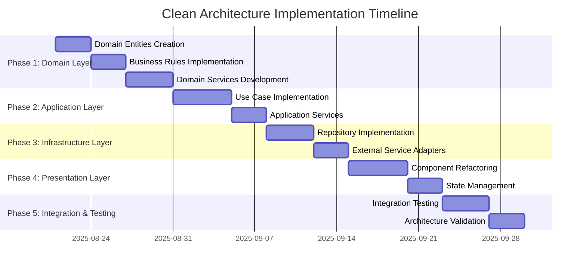

# CVPlus Clean Architecture Implementation Plan

**Plan ID**: CVPLUS-ARCH-2025-08-21  
**Author**: Gil Klainert  
**Created**: 2025-08-21  
**Type**: Architecture Modernization  
**Priority**: High  
**Status**: Planning Phase  

## Executive Summary

This plan outlines the comprehensive implementation of clean architecture patterns for CVPlus to establish scalable development patterns, reduce component coupling, and create a domain-driven design structure for sustainable growth.

## Current State Analysis

### Architecture Assessment
- **504 files** exceed 200-line limit requiring modular decomposition
- **Monolithic components** like cv-transformation.service.ts (2,083 lines)
- **Mixed concerns** in service layers and UI components
- **Complex dependencies** without clear boundaries
- **No domain separation** between business logic and infrastructure

### Key Pain Points
1. **Tight Coupling**: Components directly depend on Firebase services
2. **Mixed Responsibilities**: Business logic embedded in UI components
3. **No Domain Model**: Lack of clear business entity definitions
4. **Infrastructure Leak**: External API calls scattered throughout components
5. **Testing Complexity**: Difficult to unit test due to coupled dependencies

## Proposed Clean Architecture Structure

### Layer 1: Domain Layer (Core Business Logic)
```
domain/
├── entities/
│   ├── CV.ts
│   ├── User.ts
│   ├── Portfolio.ts
│   ├── Podcast.ts
│   └── VideoIntro.ts
├── value-objects/
│   ├── CVData.ts
│   ├── PersonalInfo.ts
│   ├── Experience.ts
│   ├── Skills.ts
│   └── Education.ts
├── domain-services/
│   ├── CVAnalysisService.ts
│   ├── QualityScoreService.ts
│   └── ContentValidationService.ts
└── specifications/
    ├── CVValidationRules.ts
    └── QualityStandards.ts
```

### Layer 2: Application Layer (Use Cases)
```
application/
├── use-cases/
│   ├── cv/
│   │   ├── AnalyzeCVUseCase.ts
│   │   ├── TransformCVUseCase.ts
│   │   └── GenerateRecommendationsUseCase.ts
│   ├── content/
│   │   ├── GeneratePodcastUseCase.ts
│   │   ├── GenerateVideoUseCase.ts
│   │   └── CreatePortfolioUseCase.ts
│   ├── user/
│   │   ├── AuthenticateUserUseCase.ts
│   │   └── ManageProfileUseCase.ts
│   └── payment/
│       ├── ProcessPaymentUseCase.ts
│       └── CheckSubscriptionUseCase.ts
├── services/
│   ├── CVApplicationService.ts
│   ├── ContentApplicationService.ts
│   └── UserApplicationService.ts
└── interfaces/
    ├── repositories/
    │   ├── ICVRepository.ts
    │   ├── IUserRepository.ts
    │   └── IContentRepository.ts
    └── external-services/
        ├── IAIService.ts
        ├── IPaymentService.ts
        └── IStorageService.ts
```

### Layer 3: Infrastructure Layer
```
infrastructure/
├── repositories/
│   ├── FirestoreCVRepository.ts
│   ├── FirestoreUserRepository.ts
│   └── FirestoreContentRepository.ts
├── external-services/
│   ├── AnthropicAIService.ts
│   ├── StripePaymentService.ts
│   ├── ElevenLabsService.ts
│   └── FirebaseStorageService.ts
├── database/
│   ├── FirestoreConnection.ts
│   └── migrations/
└── monitoring/
    ├── ErrorTrackingService.ts
    └── PerformanceMonitor.ts
```

### Layer 4: Presentation Layer (Refactored)
```
presentation/
├── containers/ (Smart Components)
│   ├── CVProcessingContainer.ts
│   ├── DashboardContainer.ts
│   └── PaymentContainer.ts
├── components/ (Dumb Components)
│   ├── cv/
│   │   ├── CVPreview.tsx
│   │   └── SkillsDisplay.tsx
│   └── portfolio/
│       └── PortfolioView.tsx
├── hooks/
│   ├── useCV.ts
│   ├── useAuth.ts
│   ├── usePayments.ts
│   └── usePodcast.ts
└── state/
    ├── providers/
    └── reducers/
```

## Implementation Phases

### Phase 1: Domain Layer Foundation (Week 11-12)
**Objective**: Establish core domain entities and business rules

#### Week 11 Tasks:
1. **Domain Entity Creation**
   - Create core entities (CV, User, Portfolio, Podcast, VideoIntro)
   - Define value objects (CVData, PersonalInfo, Experience, Skills, Education)
   - Implement domain specifications and validation rules

2. **Business Rules Implementation**
   - CV validation rules
   - Quality scoring algorithms
   - Content generation rules

#### Week 12 Tasks:
1. **Domain Services Development**
   - CVAnalysisService for business logic
   - QualityScoreService for scoring algorithms
   - ContentValidationService for validation rules

2. **Unit Testing**
   - Comprehensive test suite for domain entities
   - Business rule validation tests
   - Domain service testing

### Phase 2: Application Layer (Week 12-13)
**Objective**: Implement use cases and application services

#### Use Case Implementation:
1. **CV Processing Use Cases**
   - AnalyzeCVUseCase
   - TransformCVUseCase
   - GenerateRecommendationsUseCase

2. **Content Generation Use Cases**
   - GeneratePodcastUseCase
   - GenerateVideoUseCase
   - CreatePortfolioUseCase

3. **User Management Use Cases**
   - AuthenticateUserUseCase
   - ManageProfileUseCase

#### Application Services:
- CVApplicationService
- ContentApplicationService
- UserApplicationService

### Phase 3: Infrastructure Layer (Week 14)
**Objective**: Implement infrastructure adapters and external service integration

#### Repository Pattern Implementation:
1. **Data Access Layer**
   - FirestoreCVRepository
   - FirestoreUserRepository
   - FirestoreContentRepository

2. **External Service Adapters**
   - AnthropicAIService
   - StripePaymentService
   - ElevenLabsService
   - FirebaseStorageService

### Phase 4: Presentation Layer Refactoring (Week 15)
**Objective**: Refactor UI components following clean architecture principles

#### Component Separation:
1. **Smart Components (Containers)**
   - CVProcessingContainer
   - DashboardContainer
   - PaymentContainer

2. **Dumb Components**
   - Pure UI components with no business logic
   - Props-based data flow
   - Reusable across different contexts

#### State Management:
- Custom hooks for business logic
- Context providers for shared state
- Reducers for complex state management

### Phase 5: Integration and Testing (Week 16)
**Objective**: Integration testing and architecture compliance validation

#### Testing Strategy:
1. **Unit Testing**
   - Domain entities and services
   - Use cases
   - Infrastructure adapters

2. **Integration Testing**
   - Use case integration with repositories
   - External service integration
   - End-to-end workflow testing

3. **Architecture Compliance**
   - Dependency rule validation
   - Layer boundary enforcement
   - Code quality metrics

## Dependency Injection Container

### Container Structure:
```typescript
// infrastructure/di/Container.ts
export class DIContainer {
  private static instance: DIContainer;
  private services: Map<string, any> = new Map();

  // Repository bindings
  bind<T>(token: string, implementation: T): void;
  get<T>(token: string): T;
  
  // Service registration
  registerRepositories(): void;
  registerServices(): void;
  registerUseCases(): void;
}
```

### Service Registration:
```typescript
// Domain Services
container.bind('ICVAnalysisService', new CVAnalysisService());
container.bind('IQualityScoreService', new QualityScoreService());

// Application Services
container.bind('IAnalyzeCVUseCase', new AnalyzeCVUseCase(
  container.get('ICVRepository'),
  container.get('ICVAnalysisService')
));

// Infrastructure Services
container.bind('ICVRepository', new FirestoreCVRepository());
container.bind('IAIService', new AnthropicAIService());
```

## Architecture Compliance Validation

### Dependency Rules Enforcement:
1. **Domain Layer**: No dependencies on other layers
2. **Application Layer**: Only depends on domain layer
3. **Infrastructure Layer**: Depends on domain and application layers
4. **Presentation Layer**: Depends on application layer through interfaces

### Validation Tools:
```typescript
// tools/architecture-validator.ts
class ArchitectureValidator {
  validateDependencyRules(): ValidationResult;
  checkLayerBoundaries(): BoundaryCheck;
  generateComplianceReport(): ComplianceReport;
}
```

## File Size Compliance Strategy

### Decomposition Approach:
1. **Identify Large Files**: Files >200 lines
2. **Extract Business Logic**: Move to domain services
3. **Separate Concerns**: Split mixed responsibilities
4. **Create Focused Modules**: Single responsibility principle

### Target Metrics:
- All files <200 lines
- Average file size <100 lines
- Clear single responsibility per file

## Success Metrics

### Technical Metrics:
- **Component Coupling**: <20% interdependency
- **Code Reusability**: >60% through proper abstraction
- **Development Velocity**: 25%+ improvement
- **File Compliance**: 100% files <200 lines
- **Test Coverage**: >80% for domain and application layers

### Quality Metrics:
- **Cyclomatic Complexity**: <10 per function
- **Code Duplication**: <5%
- **Technical Debt**: <10% of codebase
- **Maintainability Index**: >80

## Risk Mitigation

### Technical Risks:
1. **Breaking Changes**: Implement behind feature flags
2. **Performance Impact**: Benchmark critical paths
3. **Team Learning Curve**: Provide training and documentation
4. **Integration Complexity**: Incremental migration approach

### Mitigation Strategies:
- **Strangler Fig Pattern**: Gradually replace old components
- **Feature Toggles**: Control rollout of new architecture
- **Comprehensive Testing**: Ensure functionality preservation
- **Documentation**: Clear migration guides and examples

## Implementation Timeline



## Next Steps

1. **Immediate Actions** (Week 11):
   - Create domain entity structure
   - Set up clean architecture folder structure
   - Implement basic dependency injection container
   - Start with CV domain entity

2. **Week 12 Priorities**:
   - Complete domain layer implementation
   - Begin use case development
   - Set up comprehensive testing framework

3. **Week 13-14 Focus**:
   - Application and infrastructure layer implementation
   - Repository pattern adoption
   - External service adapter creation

4. **Week 15-16 Finalization**:
   - Presentation layer refactoring
   - Integration testing
   - Performance optimization
   - Documentation completion

## Conclusion

This clean architecture implementation will transform CVPlus from a monolithic structure to a scalable, maintainable, and testable system. The phased approach ensures minimal disruption while establishing solid architectural foundations for future growth.

The key benefits will include:
- **Improved Maintainability**: Clear separation of concerns
- **Enhanced Testability**: Isolated business logic
- **Better Scalability**: Modular architecture
- **Reduced Technical Debt**: Clean code principles
- **Faster Development**: Reusable components and services

**Estimated Effort**: 4-5 weeks with dedicated focus  
**Team Impact**: Moderate learning curve, significant long-term benefits  
**Success Probability**: High with proper execution and team commitment