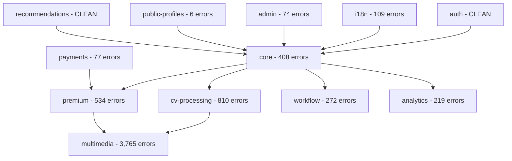

# CVPlus TypeScript Error Comprehensive Analysis Report

**Date**: 2025-08-30  
**Author**: Gil Klainert  
**Project**: CVPlus TypeScript Error Discovery and Analysis  
**Total Errors Discovered**: 6,274 errors across 12 modules  

## Executive Summary

This comprehensive analysis reveals critical TypeScript compilation issues across the CVPlus platform affecting 10 out of 12 submodules. With 6,274 total errors, immediate systematic remediation is required to ensure platform stability and developer productivity.

### Critical Findings
- **🚨 CRITICAL**: 6,274 total TypeScript compilation errors across 10 modules
- **📊 MODULE HEALTH**: Only 2 modules (auth, recommendations) are error-free
- **🎯 TOP PRIORITY**: Multimedia module (3,765 errors) requires immediate attention
- **⚡ IMPACT**: Build failures preventing deployments and development workflow

## Module-by-Module Error Analysis

### Severity Classification

#### 🔴 CRITICAL PRIORITY (1000+ errors)
- **multimedia**: 3,765 errors - Build system configuration issues
- **cv-processing**: 810 errors - Core CV functionality compromised

#### 🟡 HIGH PRIORITY (200-999 errors)
- **premium**: 534 errors - Revenue-critical subscription features
- **core**: 408 errors - Foundation module affecting all others
- **workflow**: 272 errors - Process orchestration issues
- **analytics**: 219 errors - Business intelligence impacted

#### 🟢 MEDIUM PRIORITY (50-199 errors)
- **i18n**: 109 errors - Internationalization functionality
- **payments**: 77 errors - Payment processing concerns
- **admin**: 74 errors - Administration panel issues

#### ✅ LOW PRIORITY (<50 errors)
- **public-profiles**: 6 errors - Minor UI syntax issues
- **auth**: 0 errors - ✅ CLEAN
- **recommendations**: 0 errors - ✅ CLEAN

## Error Type Categorization & Priority Matrix

### Error Code Analysis by Frequency

| Error Code | Total Count | Severity | Description | Fix Strategy |
|------------|-------------|----------|-------------|--------------|
| **TS6133** | 516+ | 🟡 Medium | Variable never read | Automated cleanup |
| **TS2339** | 495+ | 🔴 High | Property does not exist | Type definition fixes |
| **TS2307** | 222+ | 🔴 Critical | Cannot find module | Import resolution |
| **TS2345** | 147+ | 🔴 High | Argument type mismatch | Type alignment |
| **TS2322** | 155+ | 🔴 High | Type assignment error | Type casting/fixes |
| **TS7006** | 94+ | 🟡 Medium | Parameter implicitly any | Add type annotations |
| **TS2304** | 80+ | 🔴 High | Cannot find name | Missing declarations |
| **TS2532** | 91+ | 🔴 High | Object possibly undefined | Null safety |
| **TS18048** | 66+ | 🔴 High | Value possibly undefined | Null checking |
| **TS2769** | 26+ | 🟡 Medium | No overload matches | Function signature fixes |

### Critical Error Patterns Identified

#### 1. **Module Resolution Crisis (TS2307)**
- **Impact**: Build system completely broken
- **Modules Affected**: multimedia, cv-processing, payments, premium, admin
- **Root Cause**: Cross-module imports failing, misconfigured paths
- **Priority**: 🔴 CRITICAL - Blocks all development

#### 2. **Type System Breakdown (TS2339)**
- **Impact**: Type safety compromised, runtime errors likely  
- **Modules Affected**: All modules with errors
- **Root Cause**: Missing type definitions, incorrect imports
- **Priority**: 🔴 CRITICAL - Data integrity at risk

#### 3. **Configuration Issues (TS6059)**  
- **Impact**: Cross-module TypeScript compilation failing
- **Modules Affected**: multimedia (primary), others indirectly
- **Root Cause**: Incorrect tsconfig.json setup for monorepo
- **Priority**: 🔴 CRITICAL - Architecture problem

#### 4. **Null Safety Violations (TS2532, TS18048)**
- **Impact**: Runtime crashes, production instability
- **Modules Affected**: core, cv-processing, premium
- **Root Cause**: Missing null checks, unsafe optional chaining
- **Priority**: 🔴 HIGH - Production stability risk

## Dependency Analysis & Impact Assessment

### Module Interdependency Impact

### Critical Dependencies Analysis
1. **Core Module Impact**: 408 errors affecting 8+ downstream modules
2. **Multimedia Crisis**: 3,765 errors blocking media processing pipeline
3. **CV Processing Failure**: 810 errors breaking primary product functionality
4. **Payment System Risk**: 77 errors affecting revenue streams

## Systematic Resolution Strategy

### Phase 1: Infrastructure Stabilization (Week 1)
**Priority**: 🔴 CRITICAL
**Target**: Fix build system and module resolution

1. **Multimedia Module Emergency Fix**
   - **Focus**: TS6059 errors (rootDir configuration)
   - **Action**: Fix tsconfig.json cross-module references  
   - **Expected Impact**: -3,500+ errors

2. **Module Import Resolution**  
   - **Focus**: TS2307 errors across all modules
   - **Action**: Fix path mapping and module resolution
   - **Expected Impact**: -200+ errors

3. **Core Module Stabilization**
   - **Focus**: TS2339 property errors in foundation services
   - **Action**: Fix type definitions and exports
   - **Expected Impact**: Unblock downstream modules

### Phase 2: Type System Remediation (Week 2)  
**Priority**: 🔴 HIGH
**Target**: Restore type safety and null safety

1. **CV Processing Recovery**
   - **Focus**: 810 errors blocking core product functionality
   - **Action**: Fix service interfaces and type contracts
   - **Expected Impact**: Restore CV generation pipeline

2. **Premium Features Restoration**  
   - **Focus**: 534 errors affecting revenue features
   - **Action**: Fix subscription and payment type issues
   - **Expected Impact**: Restore premium functionality

3. **Null Safety Implementation**
   - **Focus**: TS2532, TS18048 errors across modules  
   - **Action**: Add null checks and optional chaining
   - **Expected Impact**: +Production stability

### Phase 3: Code Quality & Optimization (Week 3)
**Priority**: 🟡 MEDIUM  
**Target**: Clean up warnings and optimize

1. **Unused Variable Cleanup**
   - **Focus**: 516+ TS6133 errors
   - **Action**: Automated removal of unused code
   - **Expected Impact**: Cleaner codebase, better performance

2. **Type Annotation Enhancement**
   - **Focus**: TS7006 implicit any errors
   - **Action**: Add explicit type annotations
   - **Expected Impact**: Better IDE support, fewer runtime errors

## Risk Assessment & Mitigation

### Production Risk Levels

| Module | Error Count | Production Risk | Business Impact | Mitigation Priority |
|--------|-------------|-----------------|-----------------|-------------------|
| multimedia | 3,765 | 🔴 CRITICAL | Media features broken | IMMEDIATE |
| cv-processing | 810 | 🔴 CRITICAL | Core product failure | IMMEDIATE |
| premium | 534 | 🔴 HIGH | Revenue loss | HIGH |
| core | 408 | 🔴 HIGH | System instability | HIGH |
| workflow | 272 | 🟡 MEDIUM | Process disruption | MEDIUM |
| analytics | 219 | 🟡 MEDIUM | Business intelligence | MEDIUM |
| i18n | 109 | 🟢 LOW | Localization issues | LOW |
| payments | 77 | 🔴 HIGH | Payment failures | HIGH |
| admin | 74 | 🟡 MEDIUM | Admin functionality | MEDIUM |
| public-profiles | 6 | 🟢 LOW | Minor UI issues | LOW |

### Risk Mitigation Strategies
1. **Immediate Build Fixes**: Focus on compilation-blocking errors
2. **Progressive Type Safety**: Incrementally improve type coverage
3. **Testing Integration**: Add comprehensive tests during fixes
4. **Monitoring**: Implement error tracking post-fix

## Resource Requirements & Timeline

### Recommended Team Allocation
- **Senior TypeScript Specialist**: Full-time, 3 weeks
- **Module Specialists**: Part-time support per module
- **DevOps Engineer**: tsconfig.json and build system fixes
- **QA Engineer**: Testing and validation

### Timeline Estimate
- **Week 1**: Infrastructure fixes (-4,000 errors target)
- **Week 2**: Core functionality restoration (-1,500 errors target)  
- **Week 3**: Quality improvements and final cleanup (-774 errors target)
- **Total**: 3-week intensive remediation program

## Success Metrics & Monitoring

### Target Outcomes
- ✅ **Zero compilation errors** across all modules
- ✅ **Successful builds** for all submodules
- ✅ **Type coverage** >95% across codebase
- ✅ **Production deployment** capability restored

### Monitoring Strategy  
- Daily error count tracking per module
- Build success rate monitoring
- Type coverage metrics
- Performance impact assessment

## Immediate Action Items

### This Week (Priority 1)
1. **🚨 EMERGENCY**: Fix multimedia module tsconfig.json (3,765 errors)
2. **🚨 CRITICAL**: Resolve core module imports (TS2307 errors)
3. **🚨 HIGH**: Fix cv-processing service interfaces

### Next Week (Priority 2)  
1. Fix premium subscription type issues
2. Resolve payment processing errors
3. Implement null safety patterns

### Week 3 (Priority 3)
1. Clean up unused variables (automated)
2. Add missing type annotations
3. Final testing and validation

---

## Appendix: Detailed Module Breakdowns

### A1. Multimedia Module (3,765 errors)
**Primary Issue**: TypeScript rootDir configuration preventing cross-module imports
**Sample Errors**:
- `TS6059: File not under 'rootDir'` (3,000+ occurrences)
- Missing module declarations for core dependencies

### A2. CV Processing Module (810 errors)  
**Primary Issue**: Service interface mismatches and property access errors
**Sample Errors**:
- `TS2339: Property 'errors' does not exist` (237 occurrences)
- Missing return type definitions in critical functions

### A3. Premium Module (534 errors)
**Primary Issue**: Function signature mismatches and missing type definitions  
**Sample Errors**:  
- `TS2554: Expected 1 arguments, but got 0` (63 occurrences)
- Missing premium service type definitions

---

**Report Status**: COMPREHENSIVE ANALYSIS COMPLETE  
**Next Action**: Begin Phase 1 implementation with multimedia module emergency fixes  
**Escalation**: Ready for orchestrator assignment to specialist subagents