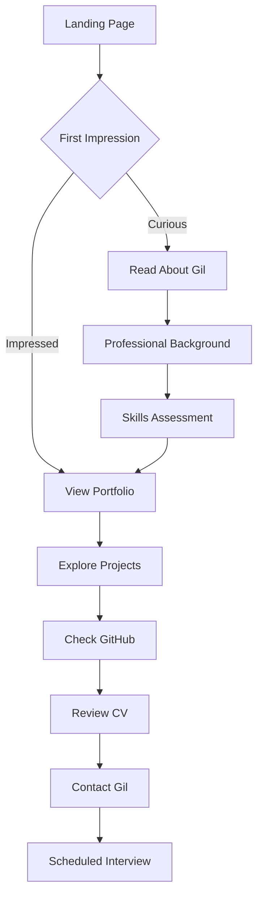
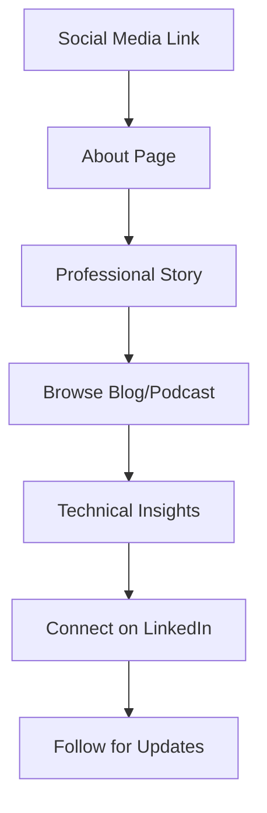
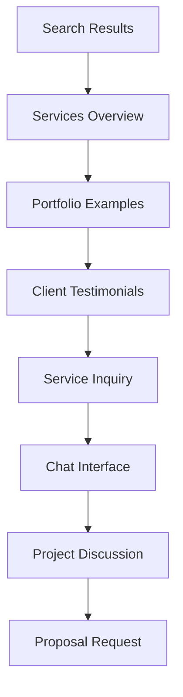

# Gil Klainert Professional Portal - Design System Specification

## Table of Contents
1. [Executive Summary](#executive-summary)
2. [Visual Design System](#visual-design-system)
3. [User Experience Flow](#user-experience-flow)
4. [Page Layouts & Wireframes](#page-layouts--wireframes)
5. [Interactive Elements](#interactive-elements)
6. [Responsive Design Strategy](#responsive-design-strategy)
7. [Accessibility Guidelines](#accessibility-guidelines)
8. [Animation & Micro-interactions](#animation--micro-interactions)
9. [Implementation Guidelines](#implementation-guidelines)

## Executive Summary

This design specification transforms Gil Klainert's web portal from an Olorin.ai corporate site into a comprehensive professional showcase. The design emphasizes:

- **Professional Technology Aesthetic**: Modern, clean design suitable for senior tech roles
- **Conversion Optimization**: Strategic CTAs for employers and recruiters
- **Multi-Modal Interaction**: Seamless voice interface integration
- **Portfolio Excellence**: GitHub-integrated project showcasing
- **Content Versatility**: Blog/podcast dual-purpose presentation
- **Professional Credibility**: CV presentation with download functionality
- **AI Enhancement**: Natural, professional chat interface

## Visual Design System

### Color Palette

#### Primary Colors
```css
:root {
  /* Technology Blues - Professional & Trustworthy */
  --tech-primary-50: #f0f9ff;
  --tech-primary-100: #e0f2fe;
  --tech-primary-200: #bae6fd;
  --tech-primary-300: #7dd3fc;
  --tech-primary-400: #38bdf8;
  --tech-primary-500: #0ea5e9;  /* Main brand */
  --tech-primary-600: #0284c7;
  --tech-primary-700: #0369a1;
  --tech-primary-800: #075985;
  --tech-primary-900: #0c4a6e;

  /* Professional Grays - Modern & Clean */
  --tech-neutral-50: #fafafa;
  --tech-neutral-100: #f4f4f5;
  --tech-neutral-200: #e4e4e7;
  --tech-neutral-300: #d4d4d8;
  --tech-neutral-400: #a1a1aa;
  --tech-neutral-500: #71717a;
  --tech-neutral-600: #52525b;
  --tech-neutral-700: #3f3f46;
  --tech-neutral-800: #27272a;
  --tech-neutral-900: #18181b;

  /* Accent Colors - Strategic Highlights */
  --tech-accent-emerald: #10b981;    /* Success/GitHub */
  --tech-accent-orange: #f59e0b;     /* Warning/Attention */
  --tech-accent-red: #ef4444;        /* Error/Critical */
  --tech-accent-purple: #8b5cf6;     /* Premium/AI */
  --tech-accent-indigo: #6366f1;     /* Links/Interactive */
}
```

#### Semantic Color Usage
```css
:root {
  /* Semantic Applications */
  --color-bg-primary: var(--tech-neutral-50);
  --color-bg-secondary: var(--tech-neutral-100);
  --color-bg-tertiary: var(--tech-primary-50);
  
  --color-text-primary: var(--tech-neutral-900);
  --color-text-secondary: var(--tech-neutral-700);
  --color-text-tertiary: var(--tech-neutral-500);
  
  --color-border-light: var(--tech-neutral-200);
  --color-border-medium: var(--tech-neutral-300);
  --color-border-strong: var(--tech-neutral-400);
  
  --color-interactive-primary: var(--tech-primary-600);
  --color-interactive-hover: var(--tech-primary-700);
  --color-interactive-active: var(--tech-primary-800);
}
```

### Typography System

#### Font Stack
```css
:root {
  /* Primary Font - Modern Sans-Serif */
  --font-primary: 'Inter', -apple-system, BlinkMacSystemFont, 'Segoe UI', 'Roboto', sans-serif;
  
  /* Secondary Font - Professional Display */
  --font-display: 'Poppins', 'Inter', sans-serif;
  
  /* Monospace - Code & Technical */
  --font-mono: 'JetBrains Mono', 'Fira Code', 'Monaco', 'Consolas', monospace;
}
```

#### Type Scale
```css
:root {
  /* Font Sizes - Modular Scale (1.25 Major Third) */
  --text-xs: 0.75rem;     /* 12px */
  --text-sm: 0.875rem;    /* 14px */
  --text-base: 1rem;      /* 16px */
  --text-lg: 1.125rem;    /* 18px */
  --text-xl: 1.25rem;     /* 20px */
  --text-2xl: 1.5rem;     /* 24px */
  --text-3xl: 1.875rem;   /* 30px */
  --text-4xl: 2.25rem;    /* 36px */
  --text-5xl: 3rem;       /* 48px */
  --text-6xl: 3.75rem;    /* 60px */
  --text-7xl: 4.5rem;     /* 72px */

  /* Line Heights */
  --leading-tight: 1.25;
  --leading-normal: 1.5;
  --leading-relaxed: 1.75;

  /* Font Weights */
  --font-light: 300;
  --font-normal: 400;
  --font-medium: 500;
  --font-semibold: 600;
  --font-bold: 700;
  --font-extrabold: 800;
}
```

#### Typography Components
```css
/* Heading Styles */
.heading-hero {
  font-family: var(--font-display);
  font-size: var(--text-6xl);
  font-weight: var(--font-bold);
  line-height: var(--leading-tight);
  letter-spacing: -0.025em;
}

.heading-section {
  font-family: var(--font-display);
  font-size: var(--text-4xl);
  font-weight: var(--font-semibold);
  line-height: var(--leading-tight);
}

.heading-subsection {
  font-family: var(--font-primary);
  font-size: var(--text-2xl);
  font-weight: var(--font-semibold);
  line-height: var(--leading-normal);
}

/* Body Text */
.text-body-large {
  font-size: var(--text-lg);
  line-height: var(--leading-relaxed);
}

.text-body-base {
  font-size: var(--text-base);
  line-height: var(--leading-normal);
}

.text-body-small {
  font-size: var(--text-sm);
  line-height: var(--leading-normal);
}

/* Technical Text */
.text-code {
  font-family: var(--font-mono);
  font-size: var(--text-sm);
  background: var(--tech-neutral-100);
  padding: 0.125rem 0.25rem;
  border-radius: 0.25rem;
}
```

### Spacing System

```css
:root {
  /* Spacing Scale - 8px Base Unit */
  --space-0: 0;
  --space-1: 0.25rem;   /* 4px */
  --space-2: 0.5rem;    /* 8px */
  --space-3: 0.75rem;   /* 12px */
  --space-4: 1rem;      /* 16px */
  --space-5: 1.25rem;   /* 20px */
  --space-6: 1.5rem;    /* 24px */
  --space-8: 2rem;      /* 32px */
  --space-10: 2.5rem;   /* 40px */
  --space-12: 3rem;     /* 48px */
  --space-16: 4rem;     /* 64px */
  --space-20: 5rem;     /* 80px */
  --space-24: 6rem;     /* 96px */
  --space-32: 8rem;     /* 128px */

  /* Layout Spacing */
  --space-section: var(--space-20);
  --space-component: var(--space-12);
  --space-element: var(--space-6);
}
```

### Component Library

#### Button Components
```css
/* Base Button */
.btn {
  display: inline-flex;
  align-items: center;
  justify-content: center;
  gap: var(--space-2);
  padding: var(--space-3) var(--space-6);
  font-family: var(--font-primary);
  font-weight: var(--font-medium);
  border-radius: 0.5rem;
  border: 1px solid transparent;
  transition: all 0.2s ease;
  cursor: pointer;
  text-decoration: none;
}

/* Button Variants */
.btn-primary {
  background: var(--color-interactive-primary);
  color: white;
  border-color: var(--color-interactive-primary);
}

.btn-primary:hover {
  background: var(--color-interactive-hover);
  border-color: var(--color-interactive-hover);
  transform: translateY(-1px);
  box-shadow: 0 8px 25px rgba(2, 132, 199, 0.3);
}

.btn-secondary {
  background: transparent;
  color: var(--color-interactive-primary);
  border-color: var(--color-interactive-primary);
}

.btn-secondary:hover {
  background: var(--color-interactive-primary);
  color: white;
}

.btn-ghost {
  background: transparent;
  color: var(--color-text-secondary);
  border-color: transparent;
}

.btn-ghost:hover {
  background: var(--tech-neutral-100);
  color: var(--color-text-primary);
}

/* Button Sizes */
.btn-sm {
  padding: var(--space-2) var(--space-4);
  font-size: var(--text-sm);
}

.btn-lg {
  padding: var(--space-4) var(--space-8);
  font-size: var(--text-lg);
}
```

#### Card Components
```css
.card {
  background: white;
  border-radius: 1rem;
  border: 1px solid var(--color-border-light);
  overflow: hidden;
  transition: all 0.3s ease;
}

.card:hover {
  transform: translateY(-4px);
  box-shadow: 0 20px 40px rgba(0, 0, 0, 0.1);
  border-color: var(--color-border-medium);
}

.card-header {
  padding: var(--space-6);
  border-bottom: 1px solid var(--color-border-light);
}

.card-body {
  padding: var(--space-6);
}

.card-footer {
  padding: var(--space-6);
  border-top: 1px solid var(--color-border-light);
  background: var(--color-bg-secondary);
}

/* Portfolio Card Variant */
.portfolio-card {
  position: relative;
  overflow: hidden;
}

.portfolio-card::before {
  content: '';
  position: absolute;
  top: 0;
  left: 0;
  right: 0;
  height: 4px;
  background: linear-gradient(90deg, var(--tech-primary-500), var(--tech-accent-purple));
}

.portfolio-card .card-image {
  height: 200px;
  background-size: cover;
  background-position: center;
  position: relative;
}

.portfolio-card .card-overlay {
  position: absolute;
  top: 0;
  left: 0;
  right: 0;
  bottom: 0;
  background: linear-gradient(135deg, rgba(14, 165, 233, 0.8), rgba(139, 92, 246, 0.8));
  opacity: 0;
  transition: opacity 0.3s ease;
  display: flex;
  align-items: center;
  justify-content: center;
}

.portfolio-card:hover .card-overlay {
  opacity: 1;
}
```

## User Experience Flow

### Primary User Journeys

#### 1. Employer/Recruiter Journey


#### 2. Professional Network Journey


#### 3. Potential Client Journey


### Voice Interface Integration Points

#### Voice Commands Map
```typescript
interface VoiceCommands {
  navigation: {
    "go to portfolio": "/portfolio",
    "show my projects": "/portfolio",
    "view my cv": "/cv",
    "contact information": "/contact",
    "about gil": "/about",
    "services offered": "/services"
  };
  
  actions: {
    "download resume": "triggerCVDownload()",
    "start chat": "openChatInterface()",
    "filter by technology": "filterPortfolio(technology)",
    "search projects": "searchPortfolio(query)",
    "play latest podcast": "playPodcast('latest')",
    "subscribe to updates": "openSubscriptionModal()"
  };
  
  contextual: {
    "tell me more": "expandCurrentSection()",
    "show details": "openDetailView()",
    "go back": "navigateBack()",
    "next project": "nextPortfolioItem()",
    "previous post": "previousBlogPost()"
  };
}
```

## Page Layouts & Wireframes

### 1. Home Page Layout

```ascii
┌─────────────────────────────────────────────────┐
│                   HEADER                        │
│  [Logo]  Nav Menu           [Voice] [Lang] [CV] │
├─────────────────────────────────────────────────┤
│                  HERO SECTION                   │
│  [Profile Image]     Gil Klainert               │
│                     Senior Full-Stack Developer │
│                     & AI Solutions Architect    │
│                                                 │
│  [View Portfolio] [Download CV] [Contact Me]    │
├─────────────────────────────────────────────────┤
│                 EXPERTISE GRID                  │
│  [React/TS]  [Python/AI]  [Cloud Arch]  [UX]   │
├─────────────────────────────────────────────────┤
│              FEATURED PROJECTS                  │
│  [Project 1]     [Project 2]     [Project 3]   │
├─────────────────────────────────────────────────┤
│                LATEST CONTENT                   │
│  Recent Blog Posts  |  Podcast Episodes         │
├─────────────────────────────────────────────────┤
│                  TESTIMONIALS                   │
│  "Gil delivered exceptional..."  - Client Name  │
├─────────────────────────────────────────────────┤
│                    FOOTER                       │
│  Social Links | Contact | Copyright             │
└─────────────────────────────────────────────────┘
```

### 2. Portfolio Page Layout

```ascii
┌─────────────────────────────────────────────────┐
│                   HEADER                        │
├─────────────────────────────────────────────────┤
│                 PAGE HERO                       │
│  Portfolio & Projects                           │
│  Showcasing technical excellence                │
├─────────────────────────────────────────────────┤
│                FILTER BAR                       │
│  [All] [React] [Python] [AI/ML] [Cloud] [UX]   │
│  [Search Projects.....................] [Sort] │
├─────────────────────────────────────────────────┤
│               PROJECT GRID                      │
│  ┌───────────┐ ┌───────────┐ ┌───────────┐     │
│  │[Img] Proj1│ │[Img] Proj2│ │[Img] Proj3│     │
│  │React/TS   │ │Python/AI  │ │Full-Stack │     │
│  │[GitHub]   │ │[GitHub]   │ │[GitHub]   │     │
│  │[Live Demo]│ │[Live Demo]│ │[Live Demo]│     │
│  └───────────┘ └───────────┘ └───────────┘     │
│                                                 │
│  ┌───────────┐ ┌───────────┐ ┌───────────┐     │
│  │[Img] Proj4│ │[Img] Proj5│ │[Img] Proj6│     │
│  │Cloud Arch │ │Mobile App │ │Data Viz   │     │
│  │[GitHub]   │ │[GitHub]   │ │[GitHub]   │     │
│  │[Live Demo]│ │[Live Demo]│ │[Live Demo]│     │
│  └───────────┘ └───────────┘ └───────────┘     │
├─────────────────────────────────────────────────┤
│                GITHUB STATS                     │
│  Contributions | Languages | Public Repos      │
├─────────────────────────────────────────────────┤
│                   FOOTER                        │
└─────────────────────────────────────────────────┘
```

### 3. About Page Layout

```ascii
┌─────────────────────────────────────────────────┐
│                   HEADER                        │
├─────────────────────────────────────────────────┤
│              PROFESSIONAL INTRO                 │
│  [Large Profile]  Professional Background       │
│                   Senior Developer & Architect  │
│                   Based in Location             │
├─────────────────────────────────────────────────┤
│                 STORY SECTION                   │
│  My Journey in Technology                       │
│  [Text content with career progression]         │
├─────────────────────────────────────────────────┤
│               SKILLS & EXPERTISE                │
│  Technical Skills     |  Professional Skills    │
│  [Skill Bars/Radar]   |  [Competency Grid]      │
├─────────────────────────────────────────────────┤
│                TIMELINE/EXPERIENCE              │
│  Career Highlights & Key Projects               │
│  [Visual Timeline with major milestones]        │
├─────────────────────────────────────────────────┤
│               PERSONAL INTERESTS                │
│  Beyond Code: Interests & Hobbies               │
│  [Icons and brief descriptions]                 │
├─────────────────────────────────────────────────┤
│                   FOOTER                        │
└─────────────────────────────────────────────────┘
```

### 4. Services Page Layout

```ascii
┌─────────────────────────────────────────────────┐
│                   HEADER                        │
├─────────────────────────────────────────────────┤
│                 PAGE HERO                       │
│  Services & Expertise                           │
│  Comprehensive development solutions            │
├─────────────────────────────────────────────────┤
│               SERVICE CATEGORIES                │
│  ┌─────────────┐ ┌─────────────┐ ┌─────────────┐│
│  │ Frontend    │ │ Backend     │ │ AI/ML       ││
│  │ Development │ │ Development │ │ Solutions   ││
│  │ [Details]   │ │ [Details]   │ │ [Details]   ││
│  └─────────────┘ └─────────────┘ └─────────────┘│
│                                                 │
│  ┌─────────────┐ ┌─────────────┐ ┌─────────────┐│
│  │ Cloud       │ │ Consulting  │ │ Training    ││
│  │ Architecture│ │ & Strategy  │ │ & Mentoring ││
│  │ [Details]   │ │ [Details]   │ │ [Details]   ││
│  └─────────────┘ └─────────────┘ └─────────────┘│
├─────────────────────────────────────────────────┤
│                 PROCESS FLOW                    │
│  Discovery → Planning → Development → Delivery  │
├─────────────────────────────────────────────────┤
│                PRICING APPROACH                 │
│  Transparent, value-based pricing structure     │
├─────────────────────────────────────────────────┤
│                   FOOTER                        │
└─────────────────────────────────────────────────┘
```

### 5. Blog/Podcast Page Layout

```ascii
┌─────────────────────────────────────────────────┐
│                   HEADER                        │
├─────────────────────────────────────────────────┤
│                 PAGE HERO                       │
│  Blog & Podcast                                 │
│  Insights, tutorials, and tech discussions      │
├─────────────────────────────────────────────────┤
│                CONTENT TABS                     │
│  [Blog Posts]  [Podcast Episodes]  [All]       │
├─────────────────────────────────────────────────┤
│               FEATURED CONTENT                  │
│  ┌─────────────────────────────────────────────┐│
│  │ [Featured Image]  Latest Blog Post Title   ││
│  │ Excerpt text here...                       ││
│  │ [Read More] [Share]          [Date] [Tags] ││
│  └─────────────────────────────────────────────┘│
├─────────────────────────────────────────────────┤
│                CONTENT GRID                     │
│  ┌─────────────┐ ┌─────────────┐ ┌─────────────┐│
│  │ [Thumbnail] │ │ [Thumbnail] │ │ [Thumbnail] ││
│  │ Post Title  │ │ Post Title  │ │ Post Title  ││
│  │ Excerpt...  │ │ Excerpt...  │ │ Excerpt...  ││
│  │ [Read More] │ │ [Listen]    │ │ [Read More] ││
│  └─────────────┘ └─────────────┘ └─────────────┘│
├─────────────────────────────────────────────────┤
│                 PAGINATION                      │
│  [Previous] 1 2 3 ... 10 [Next]                │
├─────────────────────────────────────────────────┤
│                   FOOTER                        │
└─────────────────────────────────────────────────┘
```

### 6. Contact Page Layout

```ascii
┌─────────────────────────────────────────────────┐
│                   HEADER                        │
├─────────────────────────────────────────────────┤
│                 PAGE HERO                       │
│  Let's Connect                                  │
│  Ready to discuss your next project?            │
├─────────────────────────────────────────────────┤
│              CONTACT METHODS                    │
│  ┌─────────────┐ ┌─────────────┐ ┌─────────────┐│
│  │ [Email Icon]│ │ [Phone Icon]│ │ [Chat Icon] ││
│  │ Direct Email│ │ Schedule    │ │ AI Assistant││
│  │ Response in │ │ Call        │ │ Instant     ││
│  │ 24 hours    │ │ Available   │ │ Responses   ││
│  └─────────────┘ └─────────────┘ └─────────────┘│
├─────────────────────────────────────────────────┤
│                CONTACT FORM                     │
│  Name: [________________]                       │
│  Email: [_______________]                       │
│  Subject: [_____________]                       │
│  Message: [_____________]                       │
│           [_____________]                       │
│           [_____________]                       │
│  [Send Message]                                 │
├─────────────────────────────────────────────────┤
│              SOCIAL PRESENCE                    │
│  [LinkedIn] [GitHub] [Twitter] [Medium]        │
├─────────────────────────────────────────────────┤
│                   FOOTER                        │
└─────────────────────────────────────────────────┘
```

## Interactive Elements

### Chat Interface Design

#### Chat Widget Specifications
```css
.chat-widget {
  position: fixed;
  bottom: 2rem;
  right: 2rem;
  width: 380px;
  height: 600px;
  background: white;
  border-radius: 1rem;
  box-shadow: 0 20px 40px rgba(0, 0, 0, 0.15);
  border: 1px solid var(--color-border-light);
  display: flex;
  flex-direction: column;
  overflow: hidden;
  z-index: 1000;
  transform: translateY(100vh);
  transition: transform 0.3s cubic-bezier(0.4, 0, 0.2, 1);
}

.chat-widget.open {
  transform: translateY(0);
}

.chat-header {
  background: linear-gradient(135deg, var(--tech-primary-600), var(--tech-accent-purple));
  color: white;
  padding: var(--space-4);
  display: flex;
  align-items: center;
  justify-content: space-between;
}

.chat-avatar {
  width: 40px;
  height: 40px;
  border-radius: 50%;
  background: white;
  display: flex;
  align-items: center;
  justify-content: center;
  font-weight: var(--font-bold);
  color: var(--tech-primary-600);
}

.chat-messages {
  flex: 1;
  padding: var(--space-4);
  overflow-y: auto;
  display: flex;
  flex-direction: column;
  gap: var(--space-3);
}

.chat-message {
  max-width: 80%;
  padding: var(--space-3);
  border-radius: 1rem;
  word-wrap: break-word;
}

.chat-message.user {
  align-self: flex-end;
  background: var(--tech-primary-600);
  color: white;
  border-bottom-right-radius: 0.25rem;
}

.chat-message.assistant {
  align-self: flex-start;
  background: var(--tech-neutral-100);
  color: var(--color-text-primary);
  border-bottom-left-radius: 0.25rem;
}

.chat-input-area {
  padding: var(--space-4);
  border-top: 1px solid var(--color-border-light);
  display: flex;
  gap: var(--space-2);
  align-items: flex-end;
}

.chat-input {
  flex: 1;
  padding: var(--space-3);
  border: 1px solid var(--color-border-medium);
  border-radius: 1.5rem;
  resize: none;
  max-height: 120px;
  font-family: var(--font-primary);
}

.chat-send-button {
  width: 44px;
  height: 44px;
  border-radius: 50%;
  background: var(--tech-primary-600);
  color: white;
  border: none;
  display: flex;
  align-items: center;
  justify-content: center;
  cursor: pointer;
  transition: all 0.2s ease;
}

.chat-send-button:hover {
  background: var(--tech-primary-700);
  transform: scale(1.05);
}
```

#### Voice Interface Controls
```css
.voice-controls {
  display: flex;
  align-items: center;
  gap: var(--space-2);
}

.voice-button {
  width: 48px;
  height: 48px;
  border-radius: 50%;
  background: linear-gradient(135deg, var(--tech-primary-500), var(--tech-accent-purple));
  color: white;
  border: none;
  display: flex;
  align-items: center;
  justify-content: center;
  cursor: pointer;
  transition: all 0.2s ease;
  position: relative;
  overflow: hidden;
}

.voice-button:hover {
  transform: scale(1.05);
}

.voice-button.listening {
  animation: pulse-voice 1.5s ease-in-out infinite;
}

.voice-button.listening::before {
  content: '';
  position: absolute;
  top: 0;
  left: 0;
  right: 0;
  bottom: 0;
  background: radial-gradient(circle, rgba(255, 255, 255, 0.3) 0%, transparent 70%);
  animation: ripple 1.5s ease-out infinite;
}

@keyframes pulse-voice {
  0%, 100% { transform: scale(1); }
  50% { transform: scale(1.1); }
}

@keyframes ripple {
  0% { transform: scale(0.8); opacity: 1; }
  100% { transform: scale(2); opacity: 0; }
}

.voice-status {
  display: flex;
  align-items: center;
  gap: var(--space-2);
  padding: var(--space-2) var(--space-3);
  background: var(--tech-neutral-100);
  border-radius: 1.5rem;
  font-size: var(--text-sm);
  color: var(--color-text-secondary);
}

.voice-indicator {
  width: 8px;
  height: 8px;
  border-radius: 50%;
  background: var(--tech-accent-emerald);
  animation: blink 1s ease-in-out infinite alternate;
}

@keyframes blink {
  0% { opacity: 1; }
  100% { opacity: 0.3; }
}
```

### Portfolio Filter System

```css
.portfolio-filters {
  display: flex;
  flex-wrap: wrap;
  gap: var(--space-3);
  margin-bottom: var(--space-8);
  padding: var(--space-6);
  background: white;
  border-radius: 1rem;
  border: 1px solid var(--color-border-light);
}

.filter-tag {
  padding: var(--space-2) var(--space-4);
  border: 1px solid var(--color-border-medium);
  border-radius: 2rem;
  background: transparent;
  color: var(--color-text-secondary);
  cursor: pointer;
  transition: all 0.2s ease;
  font-size: var(--text-sm);
  font-weight: var(--font-medium);
}

.filter-tag:hover {
  border-color: var(--tech-primary-400);
  color: var(--tech-primary-600);
  transform: translateY(-1px);
}

.filter-tag.active {
  background: var(--tech-primary-600);
  color: white;
  border-color: var(--tech-primary-600);
}

.filter-search {
  flex: 1;
  min-width: 250px;
  padding: var(--space-3) var(--space-4);
  border: 1px solid var(--color-border-medium);
  border-radius: 2rem;
  background: var(--tech-neutral-50);
  font-family: var(--font-primary);
}

.filter-search:focus {
  outline: none;
  border-color: var(--tech-primary-400);
  background: white;
  box-shadow: 0 0 0 3px rgba(14, 165, 233, 0.1);
}
```

## Responsive Design Strategy

### Breakpoint System

```css
:root {
  /* Breakpoints */
  --bp-xs: 375px;   /* Small phones */
  --bp-sm: 640px;   /* Large phones */
  --bp-md: 768px;   /* Tablets */
  --bp-lg: 1024px;  /* Small laptops */
  --bp-xl: 1280px;  /* Laptops */
  --bp-2xl: 1536px; /* Large screens */
}

/* Media Query Mixins */
@media (min-width: 375px) { /* xs */ }
@media (min-width: 640px) { /* sm */ }
@media (min-width: 768px) { /* md */ }
@media (min-width: 1024px) { /* lg */ }
@media (min-width: 1280px) { /* xl */ }
@media (min-width: 1536px) { /* 2xl */ }
```

### Mobile-First Approach

#### Base Styles (Mobile - 375px+)
```css
/* Mobile-first base styles */
.container {
  padding: var(--space-4);
  max-width: 100%;
}

.hero-section {
  padding: var(--space-12) 0;
  text-align: center;
}

.hero-title {
  font-size: var(--text-4xl);
  margin-bottom: var(--space-6);
}

.hero-subtitle {
  font-size: var(--text-lg);
  margin-bottom: var(--space-8);
}

.feature-grid {
  display: grid;
  grid-template-columns: 1fr;
  gap: var(--space-6);
}

.navigation {
  display: none; /* Hidden on mobile, hamburger menu instead */
}

.mobile-menu {
  display: block;
}
```

#### Tablet Styles (768px+)
```css
@media (min-width: 768px) {
  .container {
    padding: var(--space-6);
    max-width: 1200px;
    margin: 0 auto;
  }
  
  .hero-section {
    padding: var(--space-16) 0;
    text-align: left;
  }
  
  .hero-title {
    font-size: var(--text-5xl);
  }
  
  .hero-content {
    display: grid;
    grid-template-columns: 2fr 1fr;
    gap: var(--space-12);
    align-items: center;
  }
  
  .feature-grid {
    grid-template-columns: repeat(2, 1fr);
    gap: var(--space-8);
  }
  
  .navigation {
    display: flex;
  }
  
  .mobile-menu {
    display: none;
  }
}
```

#### Desktop Styles (1024px+)
```css
@media (min-width: 1024px) {
  .hero-section {
    padding: var(--space-24) 0;
  }
  
  .hero-title {
    font-size: var(--text-6xl);
  }
  
  .feature-grid {
    grid-template-columns: repeat(3, 1fr);
  }
  
  .portfolio-grid {
    grid-template-columns: repeat(3, 1fr);
  }
  
  .chat-widget {
    width: 420px;
    height: 640px;
  }
}
```

#### Large Desktop Styles (1280px+)
```css
@media (min-width: 1280px) {
  .hero-title {
    font-size: var(--text-7xl);
  }
  
  .feature-grid {
    grid-template-columns: repeat(4, 1fr);
  }
  
  .portfolio-grid {
    grid-template-columns: repeat(4, 1fr);
  }
  
  .content-with-sidebar {
    display: grid;
    grid-template-columns: 1fr 300px;
    gap: var(--space-12);
  }
}
```

### Responsive Chat Interface

```css
/* Mobile Chat (Full Screen Overlay) */
@media (max-width: 767px) {
  .chat-widget {
    position: fixed;
    top: 0;
    left: 0;
    right: 0;
    bottom: 0;
    width: 100%;
    height: 100vh;
    border-radius: 0;
    transform: translateX(100%);
  }
  
  .chat-widget.open {
    transform: translateX(0);
  }
  
  .chat-trigger {
    bottom: 1rem;
    right: 1rem;
    width: 56px;
    height: 56px;
  }
}

/* Tablet Chat (Larger Widget) */
@media (min-width: 768px) and (max-width: 1023px) {
  .chat-widget {
    width: 360px;
    height: 500px;
    bottom: 1.5rem;
    right: 1.5rem;
  }
}
```

## Accessibility Guidelines

### WCAG 2.1 AA Compliance

#### Color Contrast Standards
```css
/* Ensure minimum contrast ratios */
:root {
  /* Text on backgrounds must meet 4.5:1 ratio for normal text */
  --contrast-primary-text: #18181b; /* 21:1 ratio on white */
  --contrast-secondary-text: #3f3f46; /* 10.7:1 ratio on white */
  --contrast-tertiary-text: #71717a; /* 4.6:1 ratio on white */
  
  /* Large text (18px+ or 14px+ bold) must meet 3:1 ratio */
  --contrast-large-text: #52525b; /* 7.6:1 ratio on white */
  
  /* Interactive elements must meet 3:1 ratio for non-text contrast */
  --contrast-interactive: var(--tech-primary-600); /* 5.9:1 ratio */
  --contrast-interactive-hover: var(--tech-primary-700); /* 7.8:1 ratio */
}
```

#### Focus Indicators
```css
/* Keyboard focus indicators */
.focusable {
  outline: none;
  transition: box-shadow 0.2s ease;
}

.focusable:focus {
  box-shadow: 0 0 0 3px rgba(14, 165, 233, 0.5);
  border-color: var(--tech-primary-500);
}

/* Skip navigation */
.skip-nav {
  position: absolute;
  top: -100px;
  left: 0;
  background: var(--tech-primary-600);
  color: white;
  padding: var(--space-2) var(--space-4);
  text-decoration: none;
  z-index: 10000;
  transition: top 0.2s ease;
}

.skip-nav:focus {
  top: 0;
}
```

#### Semantic HTML Structure
```html
<!-- Proper heading hierarchy -->
<h1>Page Title</h1>
  <h2>Section Title</h2>
    <h3>Subsection Title</h3>

<!-- Landmarks -->
<header role="banner">
  <nav role="navigation" aria-label="Main navigation">
    <!-- Navigation items -->
  </nav>
</header>

<main role="main">
  <section aria-labelledby="portfolio-heading">
    <h2 id="portfolio-heading">Portfolio</h2>
    <!-- Content -->
  </section>
</main>

<aside role="complementary" aria-label="Chat assistant">
  <!-- Chat widget -->
</aside>

<footer role="contentinfo">
  <!-- Footer content -->
</footer>
```

#### ARIA Labels and Descriptions
```html
<!-- Form accessibility -->
<label for="contact-name">Name (required)</label>
<input 
  id="contact-name" 
  type="text" 
  required 
  aria-describedby="name-help"
  aria-invalid="false"
>
<div id="name-help" class="help-text">
  Please enter your full name
</div>

<!-- Interactive elements -->
<button 
  aria-label="Download CV as PDF"
  aria-describedby="cv-description"
>
  <svg aria-hidden="true"><!-- Download icon --></svg>
  Download CV
</button>
<div id="cv-description" class="sr-only">
  Downloads Gil Klainert's curriculum vitae in PDF format
</div>

<!-- Voice interface -->
<button 
  class="voice-button"
  aria-label="Activate voice commands"
  aria-pressed="false"
  aria-describedby="voice-status"
>
  <svg aria-hidden="true"><!-- Microphone icon --></svg>
</button>
<div id="voice-status" aria-live="polite" class="sr-only">
  Voice commands ready. Say "Help" for available commands.
</div>
```

#### Screen Reader Optimizations
```css
/* Screen reader only content */
.sr-only {
  position: absolute;
  width: 1px;
  height: 1px;
  padding: 0;
  margin: -1px;
  overflow: hidden;
  clip: rect(0, 0, 0, 0);
  white-space: nowrap;
  border: 0;
}

/* Screen reader focus */
.sr-only-focusable:focus {
  position: static;
  width: auto;
  height: auto;
  padding: inherit;
  margin: inherit;
  overflow: visible;
  clip: auto;
  white-space: normal;
}
```

### Keyboard Navigation

```javascript
// Keyboard navigation management
class KeyboardNavigation {
  constructor() {
    this.focusableElements = [
      'a[href]',
      'button:not([disabled])',
      'input:not([disabled])',
      'select:not([disabled])',
      'textarea:not([disabled])',
      '[tabindex]:not([tabindex="-1"])'
    ].join(',');
    
    this.init();
  }
  
  init() {
    document.addEventListener('keydown', this.handleKeyDown.bind(this));
    this.setupModalTrapping();
    this.setupSkipNavigation();
  }
  
  handleKeyDown(event) {
    switch(event.key) {
      case 'Escape':
        this.handleEscape();
        break;
      case 'Tab':
        this.handleTab(event);
        break;
      case 'Enter':
      case ' ':
        this.handleActivation(event);
        break;
    }
  }
  
  handleEscape() {
    // Close modals, dropdowns, etc.
    const openModal = document.querySelector('.modal.open');
    if (openModal) {
      this.closeModal(openModal);
    }
    
    const openDropdown = document.querySelector('.dropdown.open');
    if (openDropdown) {
      this.closeDropdown(openDropdown);
    }
  }
  
  trapFocus(container) {
    const focusableElements = container.querySelectorAll(this.focusableElements);
    const firstElement = focusableElements[0];
    const lastElement = focusableElements[focusableElements.length - 1];
    
    container.addEventListener('keydown', (event) => {
      if (event.key === 'Tab') {
        if (event.shiftKey) {
          if (document.activeElement === firstElement) {
            event.preventDefault();
            lastElement.focus();
          }
        } else {
          if (document.activeElement === lastElement) {
            event.preventDefault();
            firstElement.focus();
          }
        }
      }
    });
  }
}
```

### Voice Interface Accessibility

```javascript
// Voice accessibility enhancements
class VoiceAccessibility {
  constructor() {
    this.speechSynthesis = window.speechSynthesis;
    this.speechRecognition = window.SpeechRecognition || window.webkitSpeechRecognition;
    this.announcements = new Set();
  }
  
  announceToScreenReader(message, priority = 'polite') {
    const announcement = document.createElement('div');
    announcement.setAttribute('aria-live', priority);
    announcement.setAttribute('aria-atomic', 'true');
    announcement.className = 'sr-only';
    announcement.textContent = message;
    
    document.body.appendChild(announcement);
    
    // Clean up after announcement
    setTimeout(() => {
      document.body.removeChild(announcement);
    }, 1000);
  }
  
  provideVoiceFeedback(message) {
    if (this.speechSynthesis && !this.speechSynthesis.speaking) {
      const utterance = new SpeechSynthesisUtterance(message);
      utterance.rate = 0.9;
      utterance.pitch = 1;
      utterance.volume = 0.8;
      this.speechSynthesis.speak(utterance);
    }
  }
  
  setupVoiceCommands() {
    const commands = {
      'show navigation': () => this.focusNavigation(),
      'go to portfolio': () => this.navigateToPage('/portfolio'),
      'download resume': () => this.downloadCV(),
      'start chat': () => this.openChat(),
      'read page content': () => this.readPageContent()
    };
    
    return commands;
  }
}
```

## Animation & Micro-interactions

### Motion Design Principles

#### Animation Timing Functions
```css
:root {
  /* Easing Functions */
  --ease-out-cubic: cubic-bezier(0.33, 1, 0.68, 1);
  --ease-in-cubic: cubic-bezier(0.32, 0, 0.67, 0);
  --ease-in-out-cubic: cubic-bezier(0.65, 0, 0.35, 1);
  --ease-elastic: cubic-bezier(0.68, -0.55, 0.265, 1.55);
  
  /* Duration Scale */
  --duration-fast: 150ms;
  --duration-normal: 250ms;
  --duration-slow: 400ms;
  --duration-slower: 600ms;
}
```

#### Page Transitions
```css
/* Page transition animations */
@keyframes pageEnter {
  from {
    opacity: 0;
    transform: translateY(20px);
  }
  to {
    opacity: 1;
    transform: translateY(0);
  }
}

@keyframes pageExit {
  from {
    opacity: 1;
    transform: translateY(0);
  }
  to {
    opacity: 0;
    transform: translateY(-20px);
  }
}

.page-transition-enter {
  animation: pageEnter var(--duration-slow) var(--ease-out-cubic);
}

.page-transition-exit {
  animation: pageExit var(--duration-normal) var(--ease-in-cubic);
}
```

#### Hover Interactions
```css
/* Card hover effects */
.interactive-card {
  transition: all var(--duration-normal) var(--ease-out-cubic);
  position: relative;
  overflow: hidden;
}

.interactive-card::before {
  content: '';
  position: absolute;
  top: 0;
  left: 0;
  right: 0;
  bottom: 0;
  background: linear-gradient(135deg, transparent, rgba(14, 165, 233, 0.05));
  opacity: 0;
  transition: opacity var(--duration-normal) var(--ease-out-cubic);
}

.interactive-card:hover {
  transform: translateY(-8px);
  box-shadow: 0 20px 40px rgba(0, 0, 0, 0.15);
}

.interactive-card:hover::before {
  opacity: 1;
}

/* Button micro-interactions */
.btn-interactive {
  position: relative;
  overflow: hidden;
  transition: all var(--duration-normal) var(--ease-out-cubic);
}

.btn-interactive::before {
  content: '';
  position: absolute;
  top: 50%;
  left: 50%;
  width: 0;
  height: 0;
  background: rgba(255, 255, 255, 0.3);
  border-radius: 50%;
  transform: translate(-50%, -50%);
  transition: width var(--duration-slow) var(--ease-out-cubic),
              height var(--duration-slow) var(--ease-out-cubic);
}

.btn-interactive:active::before {
  width: 300px;
  height: 300px;
}
```

#### Loading Animations
```css
/* Loading spinner */
@keyframes spin {
  to { transform: rotate(360deg); }
}

.loading-spinner {
  width: 24px;
  height: 24px;
  border: 2px solid var(--color-border-light);
  border-top-color: var(--tech-primary-600);
  border-radius: 50%;
  animation: spin 1s linear infinite;
}

/* Skeleton loading */
@keyframes skeleton-pulse {
  0%, 100% { opacity: 1; }
  50% { opacity: 0.5; }
}

.skeleton {
  background: var(--tech-neutral-200);
  border-radius: 0.25rem;
  animation: skeleton-pulse 2s ease-in-out infinite;
}

.skeleton-text {
  height: 1rem;
  margin-bottom: 0.5rem;
}

.skeleton-text:last-child {
  width: 80%;
}
```

#### Scroll Animations
```css
/* Intersection Observer animations */
.animate-on-scroll {
  opacity: 0;
  transform: translateY(30px);
  transition: all var(--duration-slow) var(--ease-out-cubic);
}

.animate-on-scroll.in-view {
  opacity: 1;
  transform: translateY(0);
}

/* Staggered animations */
.stagger-item {
  opacity: 0;
  transform: translateY(20px);
  transition: all var(--duration-normal) var(--ease-out-cubic);
}

.stagger-item:nth-child(1) { transition-delay: 0ms; }
.stagger-item:nth-child(2) { transition-delay: 100ms; }
.stagger-item:nth-child(3) { transition-delay: 200ms; }
.stagger-item:nth-child(4) { transition-delay: 300ms; }

.stagger-container.animate .stagger-item {
  opacity: 1;
  transform: translateY(0);
}
```

### Voice Interface Animations

```css
/* Voice activation animations */
@keyframes voice-pulse {
  0% {
    transform: scale(1);
    box-shadow: 0 0 0 0 rgba(14, 165, 233, 0.7);
  }
  70% {
    transform: scale(1.05);
    box-shadow: 0 0 0 10px rgba(14, 165, 233, 0);
  }
  100% {
    transform: scale(1);
    box-shadow: 0 0 0 0 rgba(14, 165, 233, 0);
  }
}

.voice-button.listening {
  animation: voice-pulse 1.5s infinite;
}

/* Voice waveform visualization */
@keyframes wave {
  0%, 100% { height: 10px; }
  50% { height: 30px; }
}

.voice-waveform {
  display: flex;
  align-items: center;
  gap: 2px;
  height: 40px;
}

.voice-waveform .bar {
  width: 3px;
  background: var(--tech-primary-600);
  border-radius: 1.5px;
  animation: wave 1s ease-in-out infinite;
}

.voice-waveform .bar:nth-child(2) { animation-delay: 0.1s; }
.voice-waveform .bar:nth-child(3) { animation-delay: 0.2s; }
.voice-waveform .bar:nth-child(4) { animation-delay: 0.3s; }
.voice-waveform .bar:nth-child(5) { animation-delay: 0.4s; }
```

### Performance Considerations

```css
/* Reduce motion for accessibility */
@media (prefers-reduced-motion: reduce) {
  *, *::before, *::after {
    animation-duration: 0.01ms !important;
    animation-iteration-count: 1 !important;
    transition-duration: 0.01ms !important;
    scroll-behavior: auto !important;
  }
  
  .parallax {
    transform: none !important;
  }
}

/* GPU acceleration for smooth animations */
.gpu-accelerated {
  transform: translateZ(0);
  will-change: transform;
}

/* Optimize for 60fps */
.smooth-animation {
  animation-fill-mode: both;
  backface-visibility: hidden;
  perspective: 1000px;
}
```

## Implementation Guidelines

### File Structure

```
src/
├── design-system/
│   ├── tokens/
│   │   ├── colors.ts
│   │   ├── typography.ts
│   │   ├── spacing.ts
│   │   └── breakpoints.ts
│   ├── components/
│   │   ├── Button/
│   │   ├── Card/
│   │   ├── Chat/
│   │   ├── VoiceInterface/
│   │   └── index.ts
│   └── animations/
│       ├── transitions.ts
│       ├── micro-interactions.ts
│       └── keyframes.ts
├── pages/
│   ├── HomePage/
│   ├── PortfolioPage/
│   ├── AboutPage/
│   ├── ServicesPage/
│   ├── BlogPage/
│   └── ContactPage/
├── components/
│   ├── layout/
│   ├── forms/
│   ├── navigation/
│   └── interactive/
├── hooks/
│   ├── useVoiceInterface.ts
│   ├── useResponsive.ts
│   ├── useAccessibility.ts
│   └── useAnimations.ts
├── services/
│   ├── portfolioService.ts
│   ├── contentService.ts
│   ├── chatService.ts
│   └── voiceService.ts
└── utils/
    ├── accessibility.ts
    ├── responsive.ts
    └── animations.ts
```

### Development Workflow

#### Design Token Integration
```typescript
// src/design-system/tokens/colors.ts
export const colors = {
  tech: {
    primary: {
      50: '#f0f9ff',
      100: '#e0f2fe',
      500: '#0ea5e9',
      600: '#0284c7',
      900: '#0c4a6e'
    },
    neutral: {
      50: '#fafafa',
      500: '#71717a',
      900: '#18181b'
    },
    accent: {
      emerald: '#10b981',
      orange: '#f59e0b',
      red: '#ef4444',
      purple: '#8b5cf6',
      indigo: '#6366f1'
    }
  },
  semantic: {
    text: {
      primary: '#18181b',
      secondary: '#3f3f46',
      tertiary: '#71717a'
    },
    background: {
      primary: '#fafafa',
      secondary: '#f4f4f5',
      tertiary: '#f0f9ff'
    },
    interactive: {
      primary: '#0284c7',
      hover: '#0369a1',
      active: '#075985'
    }
  }
} as const;

export type ColorToken = typeof colors;
```

#### Component Development Standards
```typescript
// Component template
import React from 'react';
import { styled } from './Button.styles';
import { ButtonProps } from './Button.types';

export const Button: React.FC<ButtonProps> = ({
  variant = 'primary',
  size = 'md',
  children,
  disabled = false,
  loading = false,
  leftIcon,
  rightIcon,
  'aria-label': ariaLabel,
  ...props
}) => {
  return (
    <styled.Button
      variant={variant}
      size={size}
      disabled={disabled || loading}
      aria-label={ariaLabel}
      {...props}
    >
      {leftIcon && <styled.Icon position="left">{leftIcon}</styled.Icon>}
      {loading ? <styled.LoadingSpinner /> : children}
      {rightIcon && <styled.Icon position="right">{rightIcon}</styled.Icon>}
    </styled.Button>
  );
};
```

### Quality Assurance Checklist

#### Design Review Checklist
- [ ] Color contrast meets WCAG AA standards (4.5:1 for normal text, 3:1 for large text)
- [ ] Typography scale is consistent and readable across all devices
- [ ] Interactive elements have clear hover, focus, and active states
- [ ] Component spacing follows the 8px grid system
- [ ] Voice interface provides clear feedback and error handling
- [ ] Animations respect `prefers-reduced-motion` settings
- [ ] Loading states are implemented for all async operations
- [ ] Error states are designed and accessible
- [ ] Mobile responsiveness tested on multiple device sizes
- [ ] Keyboard navigation works for all interactive elements

#### Technical Implementation Review
- [ ] Design tokens are properly implemented and used consistently
- [ ] Components are reusable and follow composition patterns
- [ ] Accessibility attributes (ARIA) are correctly implemented
- [ ] Performance optimizations are in place (lazy loading, code splitting)
- [ ] Voice interface integrates seamlessly with existing navigation
- [ ] SEO considerations are implemented (semantic HTML, meta tags)
- [ ] Cross-browser compatibility is tested and verified
- [ ] Asset optimization (images, fonts) is implemented
- [ ] Progressive enhancement principles are followed
- [ ] Analytics and conversion tracking are properly configured

This comprehensive design specification provides a complete blueprint for transforming Gil Klainert's web portal into a professional, accessible, and conversion-optimized showcase that effectively demonstrates technical expertise while maintaining excellent user experience across all devices and interaction modalities.