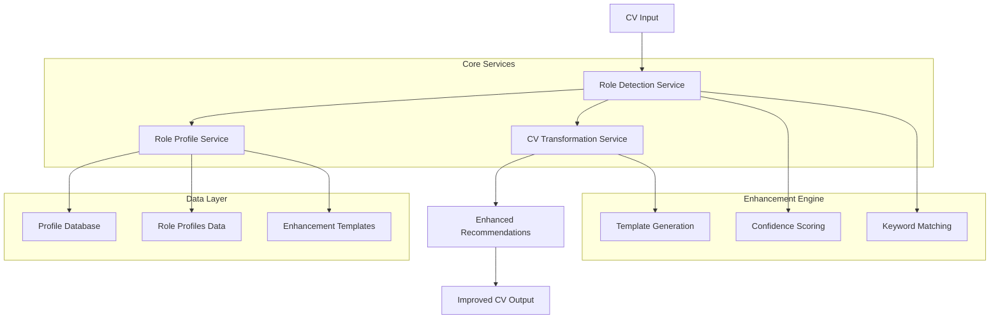

# Role Profile System Architecture

## Overview

The Role Profile System is a foundational component of CVPlus that provides intelligent role detection and CV enhancement capabilities. It analyzes CV content to identify the most suitable professional roles and generates personalized recommendations for CV improvement.

## System Architecture



## Core Components

### 1. Role Profile Types (`/types/role-profile.types.ts`)

Comprehensive TypeScript interfaces defining the structure of role profiles and related data:

- **RoleProfile**: Main interface for role definitions
- **RoleMatchResult**: Results from role detection analysis
- **RoleDetectionConfig**: Configuration for detection algorithms
- **RoleProfileAnalysis**: Complete analysis including recommendations

### 2. Role Detection Service (`/services/role-detection.service.ts`)

Intelligent service that analyzes CV content and matches it against available role profiles:

#### Key Features:
- **CV Feature Extraction**: Extracts keywords from titles, skills, experience, and education
- **Confidence Scoring**: Calculates weighted confidence scores using configurable factors
- **Multi-Role Detection**: Identifies primary and alternative role matches
- **Gap Analysis**: Identifies missing skills and weak areas

#### Algorithm:
```typescript
confidence = (
  titleMatch * 0.30 +
  skillsMatch * 0.35 +
  experienceMatch * 0.25 +
  industryMatch * 0.08 +
  educationMatch * 0.02
)
```

### 3. Role Profile Service (`/services/role-profile.service.ts`)

Manages role profile data with full CRUD operations and caching:

#### Key Features:
- **Profile Management**: Create, read, update, delete role profiles
- **Caching Layer**: In-memory caching with configurable timeout
- **Search Capabilities**: Keyword-based profile search
- **Validation**: Profile structure validation
- **Analytics**: Usage metrics and performance monitoring

### 4. Enhanced CV Transformation Service

Extended version of the existing CVTransformationService with role integration:

#### New Methods:
- `generateRoleEnhancedRecommendations()`: Combines role analysis with standard recommendations
- `applyRoleEnhancedRecommendations()`: Applies role-specific enhancements
- `getRoleEnhancementTemplates()`: Retrieves role-specific templates

### 5. Role Profiles Data (`/data/role-profiles.data.ts`)

Comprehensive profiles for five core professional domains:

1. **Software Engineer**
2. **Engineering Manager**
3. **HR Specialist**
4. **AI Product Expert**
5. **Data Scientist**

Each profile includes:
- Matching criteria with keywords
- Enhancement templates
- Skills structure recommendations
- Experience enhancement patterns
- Achievement templates

## Data Flow

### Role Detection Flow
1. **Input**: ParsedCV object
2. **Feature Extraction**: Extract relevant keywords and information
3. **Profile Matching**: Compare against all available role profiles
4. **Confidence Calculation**: Calculate weighted confidence scores
5. **Result Generation**: Return analysis with primary/alternative roles
6. **Enhancement Suggestions**: Generate role-specific recommendations

### CV Enhancement Flow
1. **Role Detection**: Identify best-matching role profile
2. **Recommendation Generation**: Create role-specific recommendations
3. **Template Application**: Apply enhancement templates
4. **Content Transformation**: Modify CV content based on recommendations
5. **Quality Validation**: Ensure improvements maintain content integrity

## Integration Points

### With Existing CVPlus Architecture

```typescript
// Enhanced CV processing pipeline
const cvTransformationService = new CVTransformationService();

// Generate role-enhanced recommendations
const recommendations = await cvTransformationService.generateRoleEnhancedRecommendations(
  parsedCV,
  true, // Enable role detection
  targetRole,
  industryKeywords
);

// Apply recommendations with role context
const result = await cvTransformationService.applyRoleEnhancedRecommendations(
  originalCV,
  selectedRecommendations,
  true // Include role analysis
);
```

### Firebase Integration

- **Firestore Collections**: `roleProfiles` collection for persistent storage
- **Cloud Functions**: Integration examples for serverless deployment
- **Caching**: Distributed caching support for high-performance scenarios

### Claude AI Integration

- Uses existing `VerifiedClaudeService` for AI-powered analysis
- Maintains compatibility with current prompting strategies
- Enhances recommendations with role-specific context

## Performance Considerations

### Caching Strategy
- **In-Memory Cache**: Role profiles cached with configurable TTL
- **Cache Invalidation**: Automatic invalidation on profile updates
- **Hit Rate Monitoring**: Performance metrics tracking

### Scalability
- **Batch Processing**: Support for processing multiple CVs
- **Concurrency Control**: Configurable concurrent processing limits
- **Resource Management**: Memory and CPU usage optimization

### Error Handling
- **Graceful Degradation**: Falls back to standard recommendations on failure
- **Comprehensive Logging**: Detailed error tracking and debugging
- **Recovery Strategies**: Automatic retry logic with exponential backoff

## Configuration Options

### Role Detection Configuration
```typescript
interface RoleDetectionConfig {
  confidenceThreshold: number;        // Minimum confidence for matches (0.6)
  maxResults: number;                 // Maximum role matches to return (5)
  enableMultiRoleDetection: boolean;  // Allow multiple role matches (true)
  weightingFactors: {
    title: number;      // Title keyword weight (0.30)
    skills: number;     // Skills keyword weight (0.35)
    experience: number; // Experience keyword weight (0.25)
    industry: number;   // Industry keyword weight (0.08)
    education: number;  // Education keyword weight (0.02)
  };
}
```

### Service Configuration
```typescript
interface RoleProfileServiceConfig {
  enableCaching: boolean;      // Enable in-memory caching (true)
  cacheTimeout: number;        // Cache TTL in ms (3600000)
  enableAnalytics: boolean;    // Enable usage analytics (true)
  defaultDetectionConfig: RoleDetectionConfig;
}
```

## Security Considerations

### Data Privacy
- **PII Protection**: No sensitive personal data stored in role profiles
- **CV Content**: Processed in-memory without persistent storage
- **Access Control**: Firebase security rules for profile management

### Input Validation
- **Profile Validation**: Comprehensive schema validation for role profiles
- **CV Sanitization**: Input sanitization for CV content
- **Parameter Validation**: Strict validation of all service parameters

## Testing Strategy

### Unit Tests
- **Service Testing**: Comprehensive test coverage for all services
- **Mock Data**: Realistic test data for different professional roles
- **Edge Cases**: Testing with incomplete or unusual CV data

### Integration Tests
- **End-to-End Flows**: Complete CV enhancement workflows
- **Performance Testing**: Load testing with multiple concurrent requests
- **Error Scenarios**: Testing failure modes and recovery

## Deployment Guide

### Prerequisites
- Firebase project with Firestore enabled
- Anthropic Claude API access
- Node.js 18+ runtime environment

### Installation Steps
1. **Install Dependencies**: `npm install` in functions directory
2. **Environment Variables**: Configure API keys and Firebase credentials
3. **Initialize Profiles**: Default profiles will be auto-created on first run
4. **Deploy Functions**: `firebase deploy --only functions`

### Monitoring
- **Service Health**: Built-in health check endpoints
- **Performance Metrics**: Processing time and success rate monitoring
- **Error Tracking**: Comprehensive error logging and alerting

## Future Enhancements

### Planned Features
- **Machine Learning Models**: Custom ML models for role detection
- **Industry Specialization**: Industry-specific role profiles
- **Real-time Learning**: Adaptive profiles based on successful matches
- **Advanced Analytics**: Detailed usage analytics and insights

### Extensibility Points
- **Custom Profiles**: API for creating organization-specific roles
- **Integration APIs**: RESTful APIs for external system integration
- **Plugin Architecture**: Support for third-party enhancement plugins

## API Reference

### Core Methods

```typescript
// Role Detection
const analysis = await roleDetectionService.detectRoles(parsedCV);
const primaryRole = await roleDetectionService.detectPrimaryRole(parsedCV);

// Role Profile Management  
const profiles = await roleProfileService.getAllProfiles();
const profile = await roleProfileService.getProfileById(id);
const engineeringProfiles = await roleProfileService.getProfilesByCategory(RoleCategory.ENGINEERING);

// CV Enhancement
const recommendations = await cvTransformationService.generateRoleEnhancedRecommendations(parsedCV);
const result = await cvTransformationService.applyRoleEnhancedRecommendations(originalCV, recommendations);
const templates = await cvTransformationService.getRoleEnhancementTemplates(parsedCV);
```

### Response Formats

```typescript
// Role Analysis Response
interface RoleProfileAnalysis {
  primaryRole: RoleMatchResult;
  alternativeRoles: RoleMatchResult[];
  overallConfidence: number;
  enhancementSuggestions: {
    immediate: RoleBasedRecommendation[];
    strategic: RoleBasedRecommendation[];
  };
  gapAnalysis: {
    missingSkills: string[];
    weakAreas: string[];
    strengthAreas: string[];
  };
}
```

## Troubleshooting

### Common Issues
- **Low Confidence Scores**: Insufficient CV content or unclear role indicators
- **No Matches Found**: CV content doesn't align with available role profiles
- **Performance Issues**: Cache misses or high concurrent load

### Debug Tools
- **Service Status**: Check service health and configuration
- **Analytics**: Review processing metrics and success rates
- **Logging**: Detailed console logs for troubleshooting

## Support and Maintenance

For technical support and contributions:
- **Documentation**: This guide and inline code documentation
- **Issue Tracking**: GitHub issues for bug reports and feature requests
- **Code Review**: Pull request process for contributions
- **Version Management**: Semantic versioning for profile updates