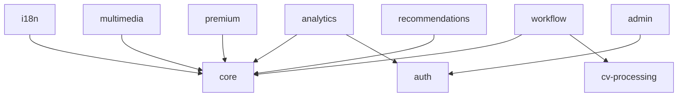

# CVPlus Dependency Analysis Report

*Generated: 2025-08-30T13:57:05.644Z*

## Executive Summary

- **Overall Compliance**: 100.00% 🏆
- **Total Modules**: 12
- **Total Violations**: 0
- **Critical Issues**: 0

## Compliance by Severity

| Severity | Score | Status |
|----------|-------|--------|
| Critical | 100% | ✅ Pass |
| Major | 100% | ✅ Pass |
| Minor | 100% | ✅ Pass |
| Warning | 100% | ℹ️ Info |

## Module Analysis

| Module | Layer | Files | Imports | Dependencies | Violations | Score |
|--------|-------|-------|---------|--------------|------------|-------|
| core | 0 | 175 | 423 | 0 | 0 | 100.0% 🏆 |
| auth | 1 | 52 | 186 | 0 | 0 | 100.0% 🏆 |
| i18n | 1 | 26 | 107 | 1 | 0 | 100.0% 🏆 |
| multimedia | 2 | 234 | 815 | 1 | 0 | 100.0% 🏆 |
| cv-processing | 2 | 202 | 648 | 0 | 0 | 100.0% 🏆 |
| analytics | 2 | 82 | 240 | 2 | 0 | 100.0% 🏆 |
| premium | 3 | 130 | 509 | 1 | 0 | 100.0% 🏆 |
| recommendations | 3 | 62 | 168 | 1 | 0 | 100.0% 🏆 |
| public-profiles | 3 | 109 | 453 | 0 | 0 | 100.0% 🏆 |
| payments | 3 | 36 | 91 | 0 | 0 | 100.0% 🏆 |
| admin | 4 | 67 | 189 | 1 | 0 | 100.0% 🏆 |
| workflow | 4 | 57 | 148 | 2 | 0 | 100.0% 🏆 |

## Violations by Module

## Dependency Graph

## Recommendations

### 🎉 Excellent Compliance Achieved!

The codebase has achieved the target 99% compliance rate.
Continue monitoring to maintain this high standard.
