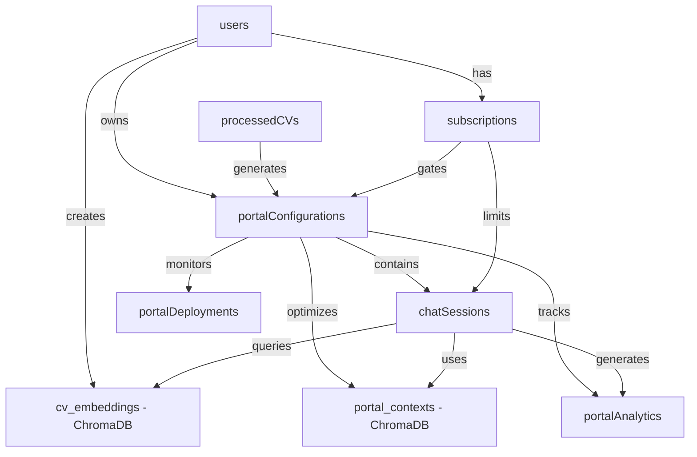
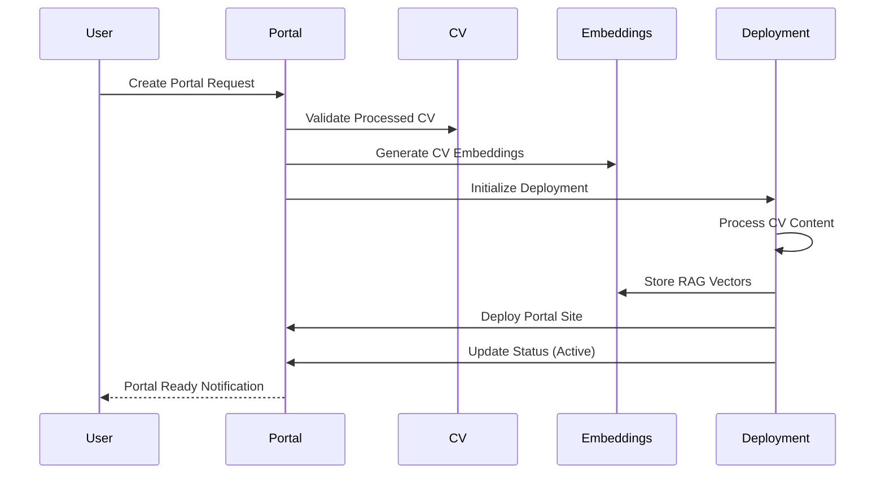
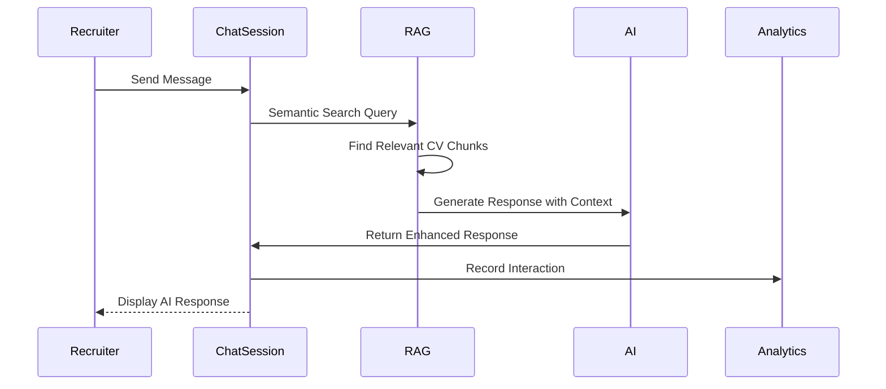
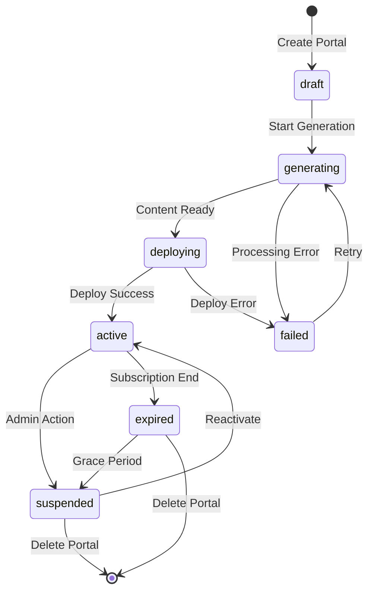
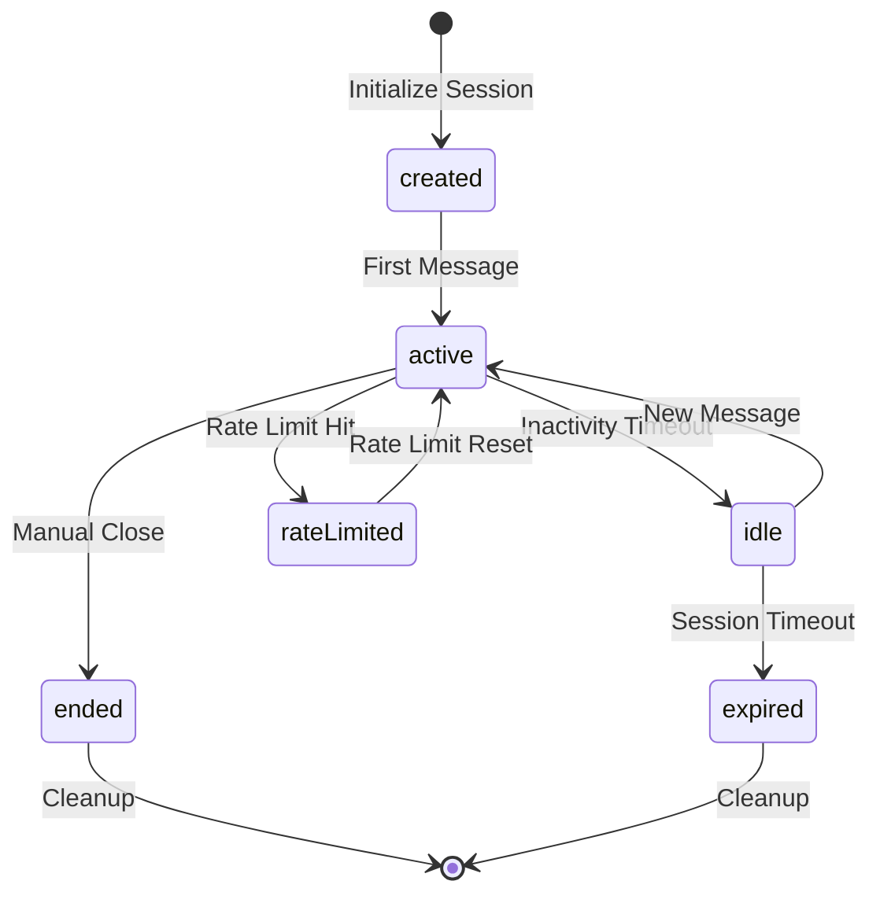
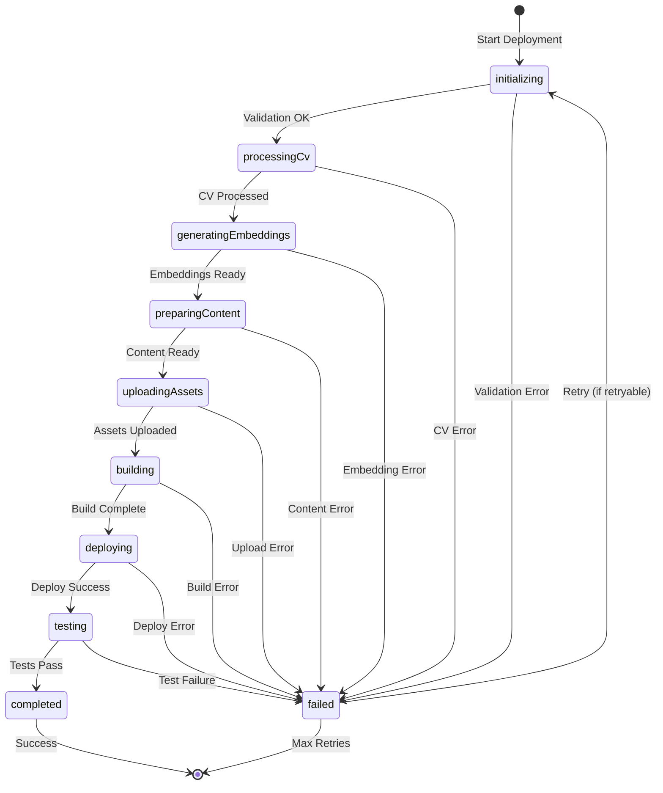

# Data Model: One Click Portal

**Date**: 2025-09-13
**Feature**: One Click Portal - Premium CV Web Portals with RAG Chat
**Author**: Gil Klainert
**Branch**: `004-one-click-portal`

## Executive Summary

This data model defines the complete data architecture for One Click Portal functionality, integrating with CVPlus's existing Firestore collections and adding ChromaDB for vector storage. The model supports premium-gated portal creation, RAG-powered AI chat, analytics tracking, and real-time deployment monitoring.

## Architecture Overview

### Database Technologies
- **Primary Storage**: Firebase Firestore (existing collections + new Portal collections)
- **Vector Database**: ChromaDB for RAG embeddings and semantic search
- **Real-time Updates**: Firestore real-time listeners for chat and deployment status
- **Caching Layer**: Redis for performance optimization (portal templates, embeddings)

### Integration with Existing CVPlus Data Model
The Portal feature integrates seamlessly with existing collections:
- `users` - Portal ownership and premium access validation
- `processedCVs` - Source content for Portal generation and RAG embeddings
- `subscriptions` - Premium feature gating and usage limits
- `publicProfiles` - Enhanced with Portal-specific metadata

---

## Firestore Schema Design

### 1. Portal Configurations Collection

**Collection**: `portalConfigurations`
**Purpose**: Store portal instances with themes, settings, and deployment information

```typescript
interface PortalConfiguration {
  // Identity & Ownership
  id: string;                           // Auto-generated document ID
  userId: string;                       // Foreign key to users collection
  cvJobId: string;                     // Foreign key to cvJobs collection
  processedCvId: string;               // Foreign key to processedCVs collection

  // Portal Metadata
  name: string;                        // User-defined portal name (1-100 chars)
  slug: string;                        // URL-safe identifier (unique, 3-50 chars)
  description?: string;                // Optional description (max 500 chars)

  // Deployment & Access
  status: PortalStatus;                // Current portal state
  deploymentUrl?: string;              // Generated portal URL after deployment
  customDomain?: string;               // Premium: custom domain mapping
  visibility: VisibilityLevel;         // public | private | unlisted
  passwordProtected: boolean;          // Enable password protection
  accessPassword?: string;             // Hashed password for protected portals

  // Content Configuration
  enabledSections: PortalSection[];    // Active CV sections in portal
  theme: PortalTheme;                  // Visual customization settings
  features: PortalFeatures;            // Enabled interactive features

  // Performance & Analytics
  viewCount: number;                   // Total portal views
  uniqueViewCount: number;             // Unique visitor count
  chatSessionCount: number;            // Total chat sessions initiated
  generationTimeSeconds?: number;      // Portal generation duration

  // Lifecycle Management
  createdAt: Timestamp;                // Portal creation time
  updatedAt: Timestamp;                // Last modification time
  deployedAt?: Timestamp;              // Successful deployment time
  lastAccessedAt?: Timestamp;          // Last visitor access time
  expiresAt?: Timestamp;               // Subscription-based expiration

  // SEO & Metadata
  metaTitle?: string;                  // Page title for SEO
  metaDescription?: string;            // Meta description for SEO
  ogImageUrl?: string;                 // Social media preview image
}
```

#### Portal Status States
```typescript
enum PortalStatus {
  DRAFT = 'draft',                     // Initial creation, not deployed
  GENERATING = 'generating',           // AI processing and content preparation
  DEPLOYING = 'deploying',             // Deployment to hosting platform
  ACTIVE = 'active',                   // Live and accessible
  SUSPENDED = 'suspended',             // Temporarily disabled
  EXPIRED = 'expired',                 // Subscription expired
  FAILED = 'failed'                    // Generation/deployment failed
}
```

#### Supporting Types
```typescript
enum VisibilityLevel {
  PUBLIC = 'public',                   // Discoverable and indexable
  UNLISTED = 'unlisted',              // Accessible via direct link only
  PRIVATE = 'private'                  // Access restricted to owner
}

enum PortalSection {
  PERSONAL_INFO = 'personalInfo',
  PROFESSIONAL_SUMMARY = 'professionalSummary',
  WORK_EXPERIENCE = 'workExperience',
  EDUCATION = 'education',
  SKILLS = 'skills',
  CERTIFICATIONS = 'certifications',
  PROJECTS = 'projects',
  PORTFOLIO = 'portfolio',
  TESTIMONIALS = 'testimonials',
  CONTACT = 'contact',
  AI_CHAT = 'aiChat'
}

interface PortalTheme {
  templateId: string;                  // Base template identifier
  primaryColor: string;                // Hex color code
  secondaryColor: string;              // Hex accent color
  backgroundColor: string;             // Background color/gradient
  textColor: string;                   // Primary text color
  fontFamily: string;                  // Web font family
  layout: 'modern' | 'classic' | 'minimal' | 'creative';
  animations: boolean;                 // Enable CSS animations
  darkMode: boolean;                   // Dark mode variant
}

interface PortalFeatures {
  aiChat: boolean;                     // RAG-powered chat interface
  qrCode: boolean;                     // QR code for easy sharing
  contactForm: boolean;                // Direct contact functionality
  calendarBooking: boolean;            // Calendar integration
  portfolioGallery: boolean;           // Interactive portfolio showcase
  socialLinks: boolean;                // Social media integration
  testimonials: boolean;               // Testimonials/reviews section
  downloadResume: boolean;             // PDF download option
  analytics: boolean;                  // Visitor analytics tracking
  customBranding: boolean;             // Remove CVPlus branding (premium)
}
```

### 2. Chat Sessions Collection

**Collection**: `chatSessions`
**Purpose**: Manage individual recruiter-AI conversations with RAG context

```typescript
interface ChatSession {
  // Identity & Association
  id: string;                          // Auto-generated document ID
  portalId: string;                    // Foreign key to portalConfigurations
  sessionToken: string;                // Anonymous visitor identifier

  // Conversation Management
  messages: ChatMessage[];             // Message history array
  isActive: boolean;                   // Accepts new messages
  language: string;                    // Chat language (inherited from CV)

  // RAG Context
  ragContextSize: number;              // Number of CV chunks in context
  lastRetrievalQuery?: string;         // Last semantic search query
  relevantSections: string[];          // CV sections referenced in chat

  // Session Metadata
  startedAt: Timestamp;                // Session initialization
  lastActivityAt: Timestamp;           // Last message timestamp
  endedAt?: Timestamp;                 // Session closure time
  sessionDurationSeconds?: number;     // Total active duration

  // Rate Limiting & Security
  messageCount: number;                // Total messages in session
  rateLimitState: RateLimitState;      // Current throttling status
  flaggedContent: boolean;             // Content moderation flag

  // Analytics Context
  visitorInfo: VisitorMetadata;        // Non-PII visitor context
  referrerUrl?: string;                // Traffic source
  userAgent?: string;                  // Browser/device information
}
```

#### Message Structure
```typescript
interface ChatMessage {
  id: string;                          // Message UUID
  content: string;                     // Message text content
  sender: 'recruiter' | 'assistant' | 'system';
  timestamp: Timestamp;                // Message creation time
  type: 'text' | 'system' | 'error';  // Message classification

  // RAG Enhancement
  sourceDocuments?: RAGSourceDocument[]; // Referenced CV sections
  confidenceScore?: number;            // AI response confidence (0-1)
  processingTimeMs?: number;           // RAG retrieval + generation time

  // Message Status
  status: 'sending' | 'sent' | 'error'; // Delivery status
  retryCount: number;                  // Failed message retry count
}

interface RAGSourceDocument {
  sectionTitle: string;                // CV section name
  content: string;                     // Referenced text content
  relevanceScore: number;              // Similarity score (0-1)
  chunkId: string;                     // Embedding chunk identifier
}

interface RateLimitState {
  remainingMessages: number;           // Messages left in current window
  windowResetAt: Timestamp;            // When rate limit resets
  isLimited: boolean;                  // Currently throttled
  warningsSent: number;               // Rate limit warnings issued
}
```

### 3. Deployment Status Collection

**Collection**: `portalDeployments`
**Purpose**: Track portal generation progress and deployment health

```typescript
interface PortalDeployment {
  // Identity
  id: string;                          // Auto-generated document ID
  portalId: string;                    // Foreign key to portalConfigurations
  deploymentNumber: number;            // Incremental deployment counter

  // Progress Tracking
  phase: DeploymentPhase;              // Current deployment stage
  progress: number;                    // Completion percentage (0-100)
  currentOperation: string;            // Current activity description

  // Timing & Performance
  startedAt: Timestamp;                // Deployment start time
  estimatedCompletionAt?: Timestamp;   // ETA based on historical data
  completedAt?: Timestamp;             // Actual completion time
  totalDurationSeconds?: number;       // End-to-end deployment time

  // Error Handling
  error?: DeploymentError;             // Error details if failed
  retryCount: number;                  // Retry attempts made
  maxRetries: number;                  // Maximum allowed retries

  // Detailed Logging
  operations: DeploymentOperation[];   // Step-by-step operation log

  // Resource Usage
  resourcesUsed: {
    cpuTimeMs: number;                 // CPU time consumed
    memoryPeakMB: number;              // Peak memory usage
    storageUsedMB: number;             // Storage space used
    apiCallsCount: number;             // External API calls made
  };
}
```

#### Deployment Phases
```typescript
enum DeploymentPhase {
  INITIALIZING = 'initializing',       // Setup and validation
  PROCESSING_CV = 'processingCv',      // CV content analysis
  GENERATING_EMBEDDINGS = 'generatingEmbeddings', // RAG preparation
  PREPARING_CONTENT = 'preparingContent', // Template and content merge
  UPLOADING_ASSETS = 'uploadingAssets', // Static asset upload
  BUILDING = 'building',               // Site compilation
  DEPLOYING = 'deploying',             // Deployment to hosting
  TESTING = 'testing',                 // Health checks and validation
  COMPLETED = 'completed',             // Successfully deployed
  FAILED = 'failed'                    // Deployment failed
}

interface DeploymentOperation {
  name: string;                        // Operation identifier
  status: 'pending' | 'running' | 'completed' | 'failed';
  startedAt: Timestamp;
  completedAt?: Timestamp;
  durationMs?: number;
  message?: string;                    // Status/error message
  metadata?: Record<string, any>;      // Operation-specific data
}

interface DeploymentError {
  code: string;                        // Error classification code
  message: string;                     // Human-readable error message
  stack?: string;                      // Error stack trace
  context: Record<string, any>;        // Error context data
  retryable: boolean;                  // Can retry deployment
  timestamp: Timestamp;
}
```

### 4. Portal Analytics Collection

**Collection**: `portalAnalytics`
**Purpose**: Track engagement metrics and visitor interactions

```typescript
interface PortalAnalytics {
  // Identity & Association
  id: string;                          // Auto-generated document ID
  portalId: string;                    // Foreign key to portalConfigurations
  userId: string;                      // Portal owner ID

  // Event Classification
  eventType: AnalyticsEventType;       // Type of tracked event
  eventCategory: string;               // Grouping category
  eventLabel?: string;                 // Event-specific label

  // Temporal Data
  timestamp: Timestamp;                // Event occurrence time
  sessionId?: string;                  // Anonymous session identifier
  sessionDuration?: number;            // Session length in seconds

  // Visitor Context (Non-PII)
  visitorInfo: {
    isReturning: boolean;              // Return vs first-time visitor
    deviceType: 'desktop' | 'mobile' | 'tablet';
    browserFamily?: string;            // Browser type (anonymized)
    osFamily?: string;                 // Operating system (anonymized)
    countryCode?: string;              // Geographic region (country level)
    referrerDomain?: string;           // Traffic source domain
    utmSource?: string;                // Marketing campaign source
    utmMedium?: string;                // Marketing campaign medium
    utmCampaign?: string;              // Marketing campaign name
  };

  // Event-Specific Data
  metadata: Record<string, any>;       // Flexible event data
  valueNumeric?: number;               // Quantitative event value
  valueText?: string;                  // Qualitative event value
}

enum AnalyticsEventType {
  PORTAL_VIEW = 'portal_view',         // Portal page view
  SECTION_VIEW = 'section_view',       // Specific section interaction
  CHAT_SESSION_START = 'chat_session_start', // AI chat initiated
  CHAT_MESSAGE_SENT = 'chat_message_sent',   // Message to AI
  CONTACT_FORM_SUBMIT = 'contact_form_submit', // Contact form submission
  RESUME_DOWNLOAD = 'resume_download', // PDF download
  SOCIAL_LINK_CLICK = 'social_link_click',   // Social media click
  PORTFOLIO_ITEM_VIEW = 'portfolio_item_view', // Portfolio interaction
  QR_CODE_SCAN = 'qr_code_scan',       // QR code usage
  BOOKMARK_ADD = 'bookmark_add',       // Portal bookmarked
  SHARE_ACTION = 'share_action'        // Portal shared
}
```

---

## ChromaDB Vector Storage Schema

### CV Embeddings Collection

**Collection Name**: `cv_embeddings`
**Purpose**: Store vector representations of CV content for RAG retrieval

```typescript
interface CVEmbeddingDocument {
  // Vector Data
  id: string;                          // Chunk identifier (UUID)
  embedding: number[];                 // 1536-dimensional vector (OpenAI ada-002)

  // Content Reference
  content: string;                     // Original text content
  userId: string;                      // CV owner ID
  cvJobId: string;                     // Source CV processing job
  processedCvId: string;               // Source processed CV

  // Content Classification
  metadata: {
    section: string;                   // CV section (experience, skills, etc.)
    sectionIndex: number;              // Position within section
    chunkIndex: number;                // Chunk position in document
    importance: number;                // Content importance score (0-1)
    tokenCount: number;                // Number of tokens in chunk

    // Content Type Classification
    contentType: 'text' | 'skill' | 'company' | 'title' | 'achievement';
    entities: string[];                // Named entities extracted
    keywords: string[];                // Important keywords

    // Quality Metrics
    coherenceScore: number;            // Content coherence (0-1)
    uniquenessScore: number;           // Content uniqueness (0-1)

    // Temporal Context
    createdAt: string;                 // Embedding creation timestamp
    embeddingModel: string;            // Model version (e.g., 'text-embedding-ada-002')
    processingVersion: string;         // Content processing pipeline version
  }
}
```

### Portal Context Collection

**Collection Name**: `portal_contexts`
**Purpose**: Store portal-specific optimized embeddings for faster RAG retrieval

```typescript
interface PortalContextDocument {
  // Vector Data
  id: string;                          // Context chunk identifier
  embedding: number[];                 // Optimized embedding for portal

  // Portal Association
  portalId: string;                    // Associated portal ID
  userId: string;                      // CV owner ID

  // Optimized Content
  content: string;                     // Portal-optimized content chunk
  summary: string;                     // Condensed summary for quick reference

  // Enhanced Metadata
  metadata: {
    priority: number;                  // Portal-specific priority (0-1)
    sections: string[];                // Multiple sections referenced
    chatRelevance: number;             // Predicted chat relevance (0-1)
    frequencyScore: number;            // Historical query frequency

    // Performance Optimization
    lastAccessedAt: string;            // Last retrieval timestamp
    accessCount: number;               // Total retrieval count
    avgRelevanceScore: number;         // Average similarity score

    // Content Enhancement
    relatedConcepts: string[];         // Related concepts/topics
    skillsMapping: string[];           // Skills mentioned
    experienceYears?: number;          // Years of experience referenced

    // Temporal Data
    createdAt: string;
    optimizedAt: string;               // Last optimization timestamp
  }
}
```

---

## Relationships & Data Flow

### Entity Relationship Diagram



### Data Flow for Portal Creation



### Data Flow for RAG Chat



---

## State Transition Models

### Portal Lifecycle States



### Chat Session Lifecycle



### Deployment Phase Transitions



---

## Query Patterns & Indexing Strategy

### Firestore Indexes

#### Compound Indexes
```javascript
// Portal lookups by user and status
{
  collection: 'portalConfigurations',
  fields: [
    { fieldPath: 'userId', order: 'ASCENDING' },
    { fieldPath: 'status', order: 'ASCENDING' },
    { fieldPath: 'updatedAt', order: 'DESCENDING' }
  ]
}

// Chat sessions by portal and activity
{
  collection: 'chatSessions',
  fields: [
    { fieldPath: 'portalId', order: 'ASCENDING' },
    { fieldPath: 'isActive', order: 'ASCENDING' },
    { fieldPath: 'lastActivityAt', order: 'DESCENDING' }
  ]
}

// Analytics by portal and time range
{
  collection: 'portalAnalytics',
  fields: [
    { fieldPath: 'portalId', order: 'ASCENDING' },
    { fieldPath: 'timestamp', order: 'DESCENDING' }
  ]
}

// Deployment status tracking
{
  collection: 'portalDeployments',
  fields: [
    { fieldPath: 'portalId', order: 'ASCENDING' },
    { fieldPath: 'deploymentNumber', order: 'DESCENDING' }
  ]
}
```

#### Single Field Indexes
```javascript
// Frequently queried fields
'portalConfigurations.slug'           // Portal URL lookup
'portalConfigurations.customDomain'   // Custom domain mapping
'chatSessions.sessionToken'           // Anonymous session lookup
'portalAnalytics.eventType'          // Event filtering
'portalDeployments.phase'            // Deployment monitoring
```

### ChromaDB Indexes

#### Vector Similarity Indexes
```python
# CV embeddings collection configuration
cv_embeddings_collection = chroma_client.create_collection(
    name="cv_embeddings",
    metadata={
        "hnsw:space": "cosine",          # Cosine similarity for text
        "hnsw:M": 16,                    # HNSW graph connections
        "hnsw:ef_construction": 200,     # Construction search parameter
        "hnsw:ef_search": 50,            # Query search parameter
    }
)

# Portal contexts collection (optimized for speed)
portal_contexts_collection = chroma_client.create_collection(
    name="portal_contexts",
    metadata={
        "hnsw:space": "cosine",
        "hnsw:M": 32,                    # Higher M for better recall
        "hnsw:ef_construction": 400,     # Higher construction quality
        "hnsw:ef_search": 100,           # Higher search quality
    }
)
```

#### Metadata Filtering Indexes
```python
# Index on frequently filtered metadata fields
cv_embeddings_metadata_indexes = [
    "userId",                           # Filter by CV owner
    "section",                          # Filter by CV section
    "importance",                       # Filter by importance score
    "contentType",                      # Filter by content type
    "embeddingModel"                    # Filter by model version
]

portal_contexts_metadata_indexes = [
    "portalId",                         # Filter by portal
    "priority",                         # Filter by priority
    "chatRelevance",                    # Filter by chat relevance
    "sections"                          # Filter by CV sections
]
```

---

## Performance Optimization Strategy

### Caching Layers

#### Redis Cache Configuration
```typescript
interface CacheStrategy {
  portalConfigurations: {
    ttl: 300,                          // 5 minutes
    keyPattern: 'portal:config:{id}',
    invalidateOn: ['update', 'deploy']
  },

  chatSessions: {
    ttl: 1800,                         // 30 minutes
    keyPattern: 'chat:session:{id}',
    invalidateOn: ['message', 'close']
  },

  ragEmbeddings: {
    ttl: 3600,                         // 1 hour
    keyPattern: 'rag:user:{userId}',
    invalidateOn: ['cv_update']
  },

  portalTemplates: {
    ttl: 7200,                         // 2 hours
    keyPattern: 'template:{themeId}',
    invalidateOn: ['template_update']
  }
}
```

### Database Connection Pooling
```typescript
interface ConnectionPoolConfig {
  firestore: {
    maxConnections: 100,
    connectionTimeout: 5000,
    idleTimeout: 30000
  },

  chromadb: {
    maxConnections: 50,
    batchSize: 100,
    queryTimeout: 3000
  },

  redis: {
    maxConnections: 20,
    retryDelayOnFailover: 100,
    maxRetriesPerRequest: 3
  }
}
```

### Query Optimization Patterns

#### Firestore Query Best Practices
```typescript
// Efficient portal listing with pagination
async function listUserPortals(userId: string, cursor?: string, limit: number = 20) {
  let query = db.collection('portalConfigurations')
    .where('userId', '==', userId)
    .where('status', 'in', ['active', 'suspended'])
    .orderBy('updatedAt', 'desc')
    .limit(limit);

  if (cursor) {
    const cursorDoc = await db.collection('portalConfigurations').doc(cursor).get();
    query = query.startAfter(cursorDoc);
  }

  return query.get();
}

// Efficient chat session cleanup
async function cleanupInactiveSessions(maxAge: number = 4 * 60 * 60 * 1000) {
  const cutoffTime = new Date(Date.now() - maxAge);

  return db.collection('chatSessions')
    .where('isActive', '==', true)
    .where('lastActivityAt', '<', cutoffTime)
    .limit(100)  // Process in batches
    .get();
}
```

#### ChromaDB Query Optimization
```python
# Optimized RAG retrieval with metadata filtering
async def query_cv_embeddings(
    user_id: str,
    query_embedding: List[float],
    portal_id: Optional[str] = None,
    sections: Optional[List[str]] = None,
    min_importance: float = 0.1,
    limit: int = 5
):
    # Build metadata filters
    where_clause = {"userId": user_id}
    if sections:
        where_clause["section"] = {"$in": sections}
    if portal_id:
        where_clause["portalId"] = portal_id

    # Query with optimized parameters
    results = await cv_embeddings_collection.query(
        query_embeddings=[query_embedding],
        n_results=limit * 2,  # Over-fetch for post-filtering
        where=where_clause,
        include=["documents", "metadatas", "distances"]
    )

    # Post-process for importance filtering
    filtered_results = [
        (doc, meta, dist) for doc, meta, dist in zip(
            results['documents'][0],
            results['metadatas'][0],
            results['distances'][0]
        )
        if meta.get('importance', 0) >= min_importance
    ]

    return filtered_results[:limit]
```

---

## Data Validation Rules

### Business Logic Constraints

#### Portal Configuration Validation
```typescript
interface PortalValidationRules {
  // Basic Constraints
  name: {
    minLength: 1,
    maxLength: 100,
    pattern: /^[a-zA-Z0-9\s\-_]+$/,
    required: true
  },

  slug: {
    minLength: 3,
    maxLength: 50,
    pattern: /^[a-z0-9\-]+$/,
    unique: true,
    reserved: ['admin', 'api', 'www', 'mail', 'ftp']
  },

  customDomain: {
    pattern: /^[a-z0-9\-\.]+\.[a-z]{2,}$/,
    maxLength: 255,
    dnsPropagated: true  // Verify DNS configuration
  },

  // Premium Feature Validation
  premiumFeatures: {
    customBranding: 'subscription.tier >= PREMIUM',
    customDomain: 'subscription.tier >= PREMIUM',
    analytics: 'subscription.tier >= PREMIUM',
    advancedChat: 'subscription.tier >= PREMIUM'
  },

  // Resource Limits
  limits: {
    maxPortalsPerUser: {
      FREE: 1,
      PREMIUM: 10,
      ENTERPRISE: 100
    },
    maxChatSessionsPerDay: {
      FREE: 0,      // No chat for free tier
      PREMIUM: 100,
      ENTERPRISE: 1000
    }
  }
}
```

#### Chat Session Validation
```typescript
interface ChatSessionValidationRules {
  // Message Constraints
  message: {
    minLength: 1,
    maxLength: 2000,
    contentFilter: true,  // Check for inappropriate content
    languageDetection: true
  },

  // Rate Limiting
  rateLimits: {
    messagesPerMinute: 10,
    messagesPerSession: 100,
    sessionDurationHours: 4,
    concurrentSessionsPerPortal: 50
  },

  // Security Constraints
  security: {
    requireSessionToken: true,
    validateIPOrigin: true,
    maxRetries: 3,
    blockSuspiciousPatterns: true
  }
}
```

### Data Integrity Constraints

#### Foreign Key Relationships
```typescript
interface ForeignKeyConstraints {
  portalConfigurations: {
    userId: 'REFERENCES users(id) ON DELETE CASCADE',
    cvJobId: 'REFERENCES cvJobs(id) ON DELETE SET NULL',
    processedCvId: 'REFERENCES processedCVs(id) ON DELETE SET NULL'
  },

  chatSessions: {
    portalId: 'REFERENCES portalConfigurations(id) ON DELETE CASCADE'
  },

  portalAnalytics: {
    portalId: 'REFERENCES portalConfigurations(id) ON DELETE CASCADE',
    userId: 'REFERENCES users(id) ON DELETE CASCADE'
  },

  portalDeployments: {
    portalId: 'REFERENCES portalConfigurations(id) ON DELETE CASCADE'
  }
}
```

#### Data Consistency Rules
```typescript
interface ConsistencyRules {
  // Portal Status Consistency
  portalStatus: {
    // Active portals must have deployed timestamp
    'status == ACTIVE': 'deployedAt IS NOT NULL',

    // Failed portals must have error details
    'status == FAILED': 'error IS NOT NULL',

    // Expired portals must have expiration date
    'status == EXPIRED': 'expiresAt <= NOW()',
  },

  // Chat Session Consistency
  chatSession: {
    // Active sessions must have recent activity
    'isActive == true': 'lastActivityAt > NOW() - INTERVAL 4 HOURS',

    // Ended sessions must have end timestamp
    'isActive == false AND endedAt IS NOT NULL': 'endedAt >= startedAt',

    // Message count must match array length
    'messageCount': 'LENGTH(messages) == messageCount'
  },

  // Analytics Consistency
  analytics: {
    // Event timestamps must be reasonable
    'timestamp': 'timestamp >= portalConfigurations.createdAt',
    'timestamp': 'timestamp <= NOW()',

    // Session analytics must reference valid sessions
    'eventType == chat_message_sent': 'sessionId IS NOT NULL'
  }
}
```

---

## Migration Plan

### Phase 1: Core Schema Implementation

#### Step 1: Create New Collections
```typescript
// Migration script: create-portal-collections.ts
async function createPortalCollections() {
  // Create collections with initial indexes
  await createCollectionWithIndexes('portalConfigurations', [
    { fields: ['userId', 'status', 'updatedAt'] },
    { fields: ['slug'] },
    { fields: ['customDomain'] }
  ]);

  await createCollectionWithIndexes('chatSessions', [
    { fields: ['portalId', 'isActive', 'lastActivityAt'] },
    { fields: ['sessionToken'] }
  ]);

  await createCollectionWithIndexes('portalAnalytics', [
    { fields: ['portalId', 'timestamp'] },
    { fields: ['eventType'] }
  ]);

  await createCollectionWithIndexes('portalDeployments', [
    { fields: ['portalId', 'deploymentNumber'] },
    { fields: ['phase'] }
  ]);
}
```

#### Step 2: Setup ChromaDB Collections
```python
# Migration script: setup-chromadb.py
async def setup_vector_collections():
    # Create CV embeddings collection
    cv_embeddings = await chroma_client.create_collection(
        name="cv_embeddings",
        metadata={"hnsw:space": "cosine", "hnsw:M": 16}
    )

    # Create portal contexts collection
    portal_contexts = await chroma_client.create_collection(
        name="portal_contexts",
        metadata={"hnsw:space": "cosine", "hnsw:M": 32}
    )

    return cv_embeddings, portal_contexts
```

### Phase 2: Data Population

#### Step 1: Migrate Existing Portal Data
```typescript
// Migration script: migrate-existing-portals.ts
async function migrateExistingPortals() {
  // Find existing public profiles that should become portals
  const existingProfiles = await db.collection('publicProfiles')
    .where('userId', '!=', null)
    .get();

  for (const profile of existingProfiles.docs) {
    const data = profile.data();

    // Create corresponding portal configuration
    const portalConfig = {
      id: profile.id,
      userId: data.userId,
      cvJobId: data.jobId,
      processedCvId: data.processedCvId,
      name: data.displayName || 'My Portal',
      slug: data.slug,
      status: data.isActive ? 'active' : 'suspended',
      visibility: data.privacyLevel,
      // Map other fields...
    };

    await db.collection('portalConfigurations').doc(profile.id).set(portalConfig);
  }
}
```

#### Step 2: Generate CV Embeddings
```python
# Migration script: generate-cv-embeddings.py
async def generate_cv_embeddings():
    # Get all processed CVs
    processed_cvs = await firestore_client.collection('processedCVs').get()

    for cv_doc in processed_cvs:
        cv_data = cv_doc.to_dict()
        user_id = cv_data['userId']

        # Generate embeddings for each CV section
        embeddings = await create_cv_embeddings(cv_data)

        # Store in ChromaDB
        await cv_embeddings_collection.add(
            documents=[chunk['content'] for chunk in embeddings],
            embeddings=[chunk['embedding'] for chunk in embeddings],
            metadatas=[chunk['metadata'] for chunk in embeddings],
            ids=[chunk['id'] for chunk in embeddings]
        )
```

### Phase 3: Service Integration

#### Step 1: Update Existing Services
```typescript
// Update public-profile.service.ts
export async function createPortalFromProfile(profileId: string) {
  const profile = await getPublicProfile(profileId);
  if (!profile) throw new Error('Profile not found');

  // Create portal configuration
  const portalConfig = await createPortalConfiguration({
    userId: profile.userId,
    cvJobId: profile.jobId,
    processedCvId: profile.processedCvId,
    name: profile.displayName,
    // ... other mappings
  });

  return portalConfig;
}
```

#### Step 2: Implement RAG Services
```typescript
// Create new rag.service.ts
export async function queryPortalContext(
  portalId: string,
  query: string,
  limit: number = 5
): Promise<RAGSearchResult[]> {
  // Generate query embedding
  const queryEmbedding = await openai.embeddings.create({
    model: 'text-embedding-ada-002',
    input: query
  });

  // Search ChromaDB
  const results = await portal_contexts_collection.query({
    query_embeddings: [queryEmbedding.data[0].embedding],
    n_results: limit,
    where: { portalId }
  });

  return results;
}
```

---

## Security & Privacy Considerations

### Data Protection

#### Personal Data Handling
```typescript
interface PrivacyCompliance {
  personalDataTypes: {
    cv_content: 'encrypted_at_rest',
    chat_messages: 'encrypted_in_transit',
    visitor_analytics: 'anonymized',
    embeddings: 'pseudonymized'
  },

  retention: {
    chat_sessions: '90_days',
    analytics: '12_months',
    embeddings: 'until_cv_deleted',
    deployment_logs: '30_days'
  },

  userRights: {
    dataExport: true,
    dataDelineation: true,
    accessControl: true,
    consentManagement: true
  }
}
```

#### Access Control Rules
```typescript
interface SecurityRules {
  portalAccess: {
    // Only portal owner can modify
    write: 'auth.uid == resource.data.userId',

    // Public portals readable by all
    read: 'resource.data.visibility == "public" || auth.uid == resource.data.userId'
  },

  chatSessions: {
    // Anyone can create sessions for public portals
    create: 'getPortal(request.resource.data.portalId).visibility == "public"',

    // Only session creator can read/write
    read: 'auth.token.sessionToken == resource.data.sessionToken',
    write: 'auth.token.sessionToken == resource.data.sessionToken'
  },

  analytics: {
    // Only portal owner can read analytics
    read: 'auth.uid == resource.data.userId',
    write: 'false'  // Only server can write
  }
}
```

### Performance Security

#### Rate Limiting Configuration
```typescript
interface RateLimitingRules {
  portalCreation: {
    FREE: '1_per_day',
    PREMIUM: '10_per_day',
    ENTERPRISE: '100_per_day'
  },

  chatMessages: {
    perSession: '10_per_minute',
    perPortal: '100_per_minute',
    perUser: '1000_per_day'
  },

  analytics: {
    perPortal: '1000_events_per_hour',
    perUser: '10000_events_per_day'
  }
}
```

#### Content Moderation
```typescript
interface ContentModerationRules {
  chatMessages: {
    profanityFilter: true,
    spamDetection: true,
    languageDetection: true,
    toxicityScoring: true
  },

  portalContent: {
    malwareScanning: true,
    linkValidation: true,
    imageContentFilter: true,
    sizeRestrictions: true
  }
}
```

---

## Monitoring & Observability

### Key Performance Indicators

#### System Performance Metrics
```typescript
interface PerformanceKPIs {
  portalGeneration: {
    averageTimeSeconds: 45,          // Target: < 60 seconds
    successRate: 0.99,               // Target: > 99%
    p95LatencySeconds: 55,           // Target: < 60 seconds
    concurrentGenerations: 10        // Target: support 10 concurrent
  },

  ragChatResponse: {
    averageLatencyMs: 2500,          // Target: < 3000ms
    p95LatencyMs: 4000,             // Target: < 5000ms
    accuracyScore: 0.85,            // Target: > 80%
    contextRelevanceScore: 0.90     // Target: > 85%
  },

  systemReliability: {
    uptime: 0.999,                   // Target: 99.9%
    errorRate: 0.001,                // Target: < 0.1%
    databaseResponseTime: 50,        // Target: < 100ms
    vectorSearchLatency: 200         // Target: < 500ms
  }
}
```

#### Business Metrics
```typescript
interface BusinessKPIs {
  portalUsage: {
    dailyActivePortals: number,
    chatSessionsPerPortal: number,
    averageSessionDuration: number,
    recruiterEngagementRate: number
  },

  subscriptionMetrics: {
    portalFeatureUsage: number,
    conversionFromFreeToP premium: number,
    churnRateAfterPortalCreation: number
  }
}
```

### Alerting Configuration

#### Critical Alerts
```typescript
interface AlertingRules {
  critical: {
    portalGenerationFailureRate: '>5%',
    chatServiceDowntime: '>30s',
    vectorDatabaseLatency: '>2s',
    subscriptionValidationErrors: '>1%'
  },

  warning: {
    portalGenerationLatency: '>45s',
    chatResponseLatency: '>3s',
    dailyActivePortalsDrop: '>20%',
    storageUsageGrowth: '>80%'
  },

  informational: {
    newPortalCreated: true,
    chatSessionStarted: true,
    subscriptionUpgrade: true,
    deploymentCompleted: true
  }
}
```

---

## Summary & Next Steps

### Implementation Readiness Assessment

✅ **Complete**: Data model design with comprehensive schema
✅ **Complete**: Relationship mapping and foreign key constraints
✅ **Complete**: State transition models for all entities
✅ **Complete**: Query patterns and indexing strategy
✅ **Complete**: Performance optimization guidelines
✅ **Complete**: Security and privacy considerations
✅ **Complete**: Migration plan from existing data
✅ **Complete**: Monitoring and observability framework

### Ready for Implementation

This data model provides the complete foundation for implementing the One Click Portal feature with:

1. **Firestore Collections**: 4 new collections integrated with existing CVPlus data
2. **ChromaDB Integration**: Vector storage for RAG functionality
3. **Performance Optimizations**: Caching, indexing, and query patterns
4. **Security Controls**: Access rules, rate limiting, and privacy compliance
5. **Migration Strategy**: Step-by-step plan to implement without disruption

### Recommended Implementation Order

1. **Phase 1 (Week 1-2)**: Create Firestore collections and basic CRUD operations
2. **Phase 2 (Week 2-3)**: Implement ChromaDB integration and RAG services
3. **Phase 3 (Week 3-4)**: Build portal generation and deployment pipeline
4. **Phase 4 (Week 4-5)**: Implement chat interface and real-time features
5. **Phase 5 (Week 5-6)**: Add analytics, monitoring, and performance optimization

The data model is production-ready and provides a solid foundation for the One Click Portal premium feature implementation.

---

**Data Model Status**: ✅ COMPLETE
**Review Date**: 2025-09-13
**Next Phase**: Contract Design & API Specification