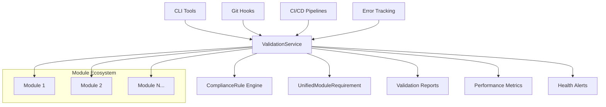

# CVPlus Unified Module Requirements

[](https://badge.fury.io/js/cvplus-unified-module-requirements)
[](https://github.com/cvplus/unified-module-requirements/actions)
[](https://codecov.io/gh/cvplus/unified-module-requirements)
[](https://opensource.org/licenses/MIT)

A comprehensive validation and compliance framework for modern JavaScript/TypeScript modular architectures, specifically designed for CVPlus's git submodule-based development approach.

## 🚀 Features

- **🔍 Module Validation**: Comprehensive validation of module structure, dependencies, and code quality
- **⚙️ Compliance Rules**: Configurable rules for architectural standards and best practices
- **🔗 Integration Support**: Git hooks, CI/CD pipelines, and error tracking integration
- **🛠️ CLI Tools**: Command-line utilities for validation, generation, migration, and monitoring
- **📊 Performance Monitoring**: Benchmarking and performance analysis capabilities
- **🎨 Extensible Architecture**: Plugin-based system supporting custom rules and integrations

## 📦 Installation

```bash
# Install globally for CLI access
npm install -g cvplus-unified-module-requirements

# Or install locally in your project
npm install cvplus-unified-module-requirements

# Or use without installation
npx umr --help
```

## ⚡ Quick Start

### CLI Usage

```bash
# Validate a module
npx umr validate ./packages/my-module

# Validate all modules recursively
npx umr validate ./packages --recursive

# Generate a new module
npx umr generate module --name=my-new-module --template=typescript

# Install git hooks for automated validation
npx umr install-hooks

# Monitor module ecosystem health
npx umr monitor --watch
```

### Programmatic Usage

```typescript
import { ValidationService, ComplianceRule } from 'cvplus-unified-module-requirements';

// Create validation service
const validator = new ValidationService();

// Define validation rules
const rules = [
  ComplianceRule.createBuiltInRule('moduleStructure'),
  ComplianceRule.createBuiltInRule('dependencyValidation'),
  ComplianceRule.createBuiltInRule('fileSize', { maxLines: 200 })
];

// Validate a module
const result = await validator.validateModule('./packages/auth', rules);

if (result.summary.failed === 0) {
  console.log('✅ Module validation passed!');
} else {
  console.log('❌ Module validation failed');
  result.results
    .filter(r => r.status === 'failed')
    .forEach(r => console.log(`  ${r.rule}: ${r.message}`));
}
```

## 🏗️ Architecture



## 📚 Documentation

### Quick Links
- **[📖 Getting Started](./docs/guides/getting-started.md)** - Start here for setup and basic usage
- **[🔧 API Reference](./docs/api/ValidationService.md)** - Complete API documentation
- **[💡 Examples](./docs/examples/basic-validation.md)** - Practical examples and use cases
- **[🖥️ CLI Reference](./docs/guides/cli-reference.md)** - Complete CLI command reference

### Guides
- [Module Validation](./docs/guides/module-validation.md)
- [Compliance Rules](./docs/guides/compliance-rules.md)
- [Integration Setup](./docs/guides/integration-setup.md)
- [Performance Optimization](./docs/guides/performance-optimization.md)

### Examples
- [Basic Validation](./docs/examples/basic-validation.md)
- [Custom Rules](./docs/examples/custom-rules.md)
- [Git Hooks Integration](./docs/examples/git-hooks-integration.md)
- [CI/CD Pipeline Setup](./docs/examples/cicd-setup.md)

### Architecture
- [📊 System Overview](./docs/diagrams/system-overview.html) - Interactive architecture diagram
- [🔄 Validation Flow](./docs/diagrams/validation-flow.html) - Validation process visualization

## 🔧 Configuration

Create a `umr.config.json` file in your project root:

```json
{
  "rules": [
    {
      "name": "moduleStructure",
      "enabled": true,
      "severity": "error"
    },
    {
      "name": "dependencyValidation",
      "enabled": true,
      "severity": "error"
    },
    {
      "name": "fileSize",
      "enabled": true,
      "severity": "warning",
      "options": {
        "maxLines": 200,
        "maxSize": "50KB"
      }
    }
  ],
  "validation": {
    "parallel": true,
    "maxConcurrency": 4,
    "timeout": 30000
  },
  "output": {
    "format": "detailed",
    "destination": "./validation-reports"
  }
}
```

## 🔌 Integrations

### Git Hooks

Automatically validate modules on git operations:

```bash
# Install git hooks
npx umr install-hooks

# Configure hooks
npx umr install-hooks --hooks=pre-commit,pre-push --auto-fix
```

### CI/CD Pipelines

#### GitHub Actions

```yaml
name: Module Validation
on: [push, pull_request]

jobs:
  validate:
    runs-on: ubuntu-latest
    steps:
      - uses: actions/checkout@v3
      - uses: actions/setup-node@v3
        with:
          node-version: '18'
      - run: npm ci
      - run: npx umr validate --all --format=github-actions
```

#### GitLab CI

```yaml
validate_modules:
  stage: test
  script:
    - npm ci
    - npx umr validate --all --format=junit
  artifacts:
    reports:
      junit: validation-reports/*.xml
```

### Error Tracking

Configure error tracking for validation failures:

```typescript
import { ErrorTracking } from 'cvplus-unified-module-requirements/integrations';

const errorTracking = new ErrorTracking({
  provider: 'sentry',
  dsn: 'https://your-dsn@sentry.io/project',
  environment: 'production'
});

// Error tracking is automatically integrated with ValidationService
```

## 🏃‍♂️ Performance

### Benchmarks

- **Validation Speed**: ~500 modules/minute on standard hardware
- **Memory Usage**: <100MB for typical projects
- **Parallel Processing**: 4x faster with parallel validation enabled
- **Cache Efficiency**: 90%+ cache hit rate for repeated validations

### Optimization Tips

```bash
# Enable parallel processing
npx umr validate --parallel --max-concurrency=8

# Use caching for faster repeated validations
npx umr validate --cache

# Filter rules for specific scenarios
npx umr validate --rules=structure,dependencies
```

## 🤝 Contributing

We welcome contributions! Please see our [Contributing Guide](./CONTRIBUTING.md) for details.

### Development Setup

```bash
# Clone the repository
git clone https://github.com/cvplus/unified-module-requirements.git
cd unified-module-requirements

# Install dependencies
npm install

# Run tests
npm test

# Run tests with coverage
npm run test:coverage

# Build the project
npm run build

# Run linting
npm run lint

# Run type checking
npm run type-check
```

### Project Structure

```
unified-module-requirements/
├── src/                      # Source code
│   ├── cli/                  # CLI tools
│   ├── integrations/         # External integrations
│   ├── models/               # Data models
│   └── services/             # Core services
├── tests/                    # Test suites
│   ├── unit/                 # Unit tests
│   ├── integration/          # Integration tests
│   └── performance/          # Performance tests
├── docs/                     # Documentation
│   ├── api/                  # API reference
│   ├── guides/               # User guides
│   ├── examples/             # Code examples
│   └── diagrams/             # Architecture diagrams
└── scripts/                  # Build and utility scripts
```

## 📋 Requirements

- **Node.js**: 18.0.0 or higher
- **TypeScript**: 4.9.0 or higher (for TypeScript projects)
- **Git**: 2.30.0 or higher (for git integration features)

## 🌍 Supported Platforms

- **Package Managers**: npm, yarn, pnpm
- **CI/CD Platforms**: GitHub Actions, GitLab CI, Jenkins, Azure DevOps, CircleCI
- **Error Tracking**: Sentry, Bugsnag, Rollbar
- **Operating Systems**: macOS, Linux, Windows

## 📊 Statistics


## 🗺️ Roadmap

### v1.1.0 (Q1 2024)
- [ ] Enhanced security rule set
- [ ] Visual Studio Code extension
- [ ] Advanced performance profiling
- [ ] Custom rule marketplace

### v1.2.0 (Q2 2024)
- [ ] Machine learning-based rule suggestions
- [ ] Real-time collaboration features
- [ ] Advanced analytics dashboard
- [ ] Plugin ecosystem

### v2.0.0 (Q3 2024)
- [ ] Distributed validation architecture
- [ ] Multi-language support (Python, Java)
- [ ] Cloud-native deployment options
- [ ] Enterprise features

## 🆘 Support

- **📖 Documentation**: [docs/](./docs/)
- **🐛 Issues**: [GitHub Issues](https://github.com/cvplus/unified-module-requirements/issues)
- **💬 Discussions**: [GitHub Discussions](https://github.com/cvplus/unified-module-requirements/discussions)
- **📧 Email**: support@cvplus.com

## 📄 License

This project is licensed under the MIT License - see the [LICENSE](./LICENSE) file for details.

## 🙏 Acknowledgments

- Built with ❤️ by the CVPlus team
- Inspired by modern software architecture principles
- Thanks to all contributors and the open-source community

---

<div align="center">

**[⭐ Star this repository](https://github.com/cvplus/unified-module-requirements)** if you find it helpful!

Made with ❤️ by [CVPlus](https://cvplus.com)

</div>