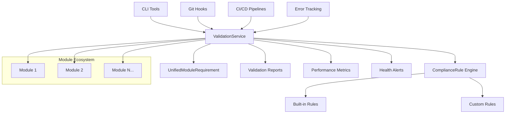

# CVPlus Unified Module Requirements System

A comprehensive validation and compliance framework for modern JavaScript/TypeScript modular architectures, specifically designed for CVPlus's git submodule-based development approach.

## Overview

The Unified Module Requirements System provides:

- **Module Validation**: Comprehensive validation of module structure, dependencies, and code quality
- **Compliance Rules**: Configurable rules for architectural standards and best practices
- **Integration Support**: Git hooks, CI/CD pipelines, and error tracking integration
- **CLI Tools**: Command-line utilities for validation, generation, migration, and monitoring
- **Performance Monitoring**: Benchmarking and performance analysis capabilities

## Quick Start

### Installation

```bash
npm install cvplus-unified-module-requirements
```

### Basic Usage

```typescript
import { ValidationService, ComplianceRule } from 'cvplus-unified-module-requirements';

const validator = new ValidationService();
const rules = [
  ComplianceRule.createBuiltInRule('moduleStructure'),
  ComplianceRule.createBuiltInRule('dependencyValidation'),
  ComplianceRule.createBuiltInRule('fileSize', { maxLines: 200 })
];

// Validate a module
const result = await validator.validateModule('/path/to/module', rules);
console.log(result.summary);
```

### CLI Usage

```bash
# Validate modules
npx umr validate ./packages/my-module

# Generate module template
npx umr generate --type=submodule --name=my-new-module

# Monitor module ecosystem
npx umr monitor --watch --threshold=90

# Migrate existing code
npx umr migrate --from=monolith --to=submodules
```

## Documentation

### Guides
- [Getting Started](./guides/getting-started.md)
- [Module Validation](./guides/module-validation.md)
- [Compliance Rules](./guides/compliance-rules.md)
- [Integration Setup](./guides/integration-setup.md)
- [CLI Reference](./guides/cli-reference.md)
- [Performance Optimization](./guides/performance-optimization.md)

### API Reference
- [ValidationService](./api/ValidationService.md)
- [ComplianceRule](./api/ComplianceRule.md)
- [UnifiedModuleRequirement](./api/UnifiedModuleRequirement.md)
- [Integrations](./api/integrations.md)
- [CLI Tools](./api/cli-tools.md)

### Examples
- [Basic Validation](./examples/basic-validation.md)
- [Custom Rules](./examples/custom-rules.md)
- [Git Hooks Integration](./examples/git-hooks-integration.md)
- [CI/CD Pipeline Setup](./examples/cicd-setup.md)
- [Error Tracking Configuration](./examples/error-tracking.md)

### Architecture
- [System Overview](./diagrams/system-overview.html)
- [Module Validation Flow](./diagrams/validation-flow.html)
- [Integration Architecture](./diagrams/integration-architecture.html)

## Features

### 🔍 Module Validation
- **Structure Validation**: Ensures proper module organization and file structure
- **Dependency Analysis**: Validates dependencies and prevents circular references
- **Code Quality**: Enforces coding standards and best practices
- **Performance Checks**: Monitors module performance and resource usage

### ⚙️ Compliance Rules
- **Built-in Rules**: Pre-configured rules for common scenarios
- **Custom Rules**: Create domain-specific validation rules
- **Rule Composition**: Combine multiple rules for comprehensive validation
- **Severity Levels**: Configure rule severity (info, warning, error, critical)

### 🔗 Integrations
- **Git Hooks**: Pre-commit, pre-push, and post-merge validation
- **CI/CD Pipelines**: GitHub Actions, GitLab CI, Jenkins, Azure DevOps, CircleCI
- **Error Tracking**: Sentry, Bugsnag, Rollbar integration
- **Performance Monitoring**: Real-time performance tracking and alerts

### 🛠️ CLI Tools
- **Validator**: Comprehensive module validation with detailed reporting
- **Generator**: Template-based module and configuration generation
- **Migrator**: Automated migration from monolithic to modular architecture
- **Monitor**: Real-time ecosystem monitoring and health checks

### 📊 Performance & Analytics
- **Benchmarking**: Performance benchmarks and trend analysis
- **Metrics Collection**: Detailed validation metrics and reporting
- **Health Monitoring**: Continuous ecosystem health monitoring
- **Alerting**: Configurable alerts for critical issues

## Architecture Overview



## Requirements

- **Node.js**: 18.0.0 or higher
- **TypeScript**: 4.9.0 or higher (for TypeScript projects)
- **Git**: 2.30.0 or higher (for git integration features)

## Supported Platforms

- **Package Managers**: npm, yarn, pnpm
- **CI/CD Platforms**: GitHub Actions, GitLab CI, Jenkins, Azure DevOps, CircleCI
- **Error Tracking**: Sentry, Bugsnag, Rollbar
- **Operating Systems**: macOS, Linux, Windows

## License

MIT License - see [LICENSE](../LICENSE) for details.

## Contributing

See [CONTRIBUTING.md](../CONTRIBUTING.md) for contribution guidelines.

## Support

- **Documentation**: [docs/](./docs/)
- **Issues**: [GitHub Issues](https://github.com/cvplus/unified-module-requirements/issues)
- **Discussions**: [GitHub Discussions](https://github.com/cvplus/unified-module-requirements/discussions)

---

**CVPlus Unified Module Requirements System** - Ensuring architectural excellence through comprehensive validation and compliance.